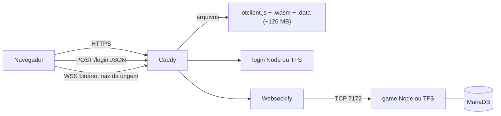
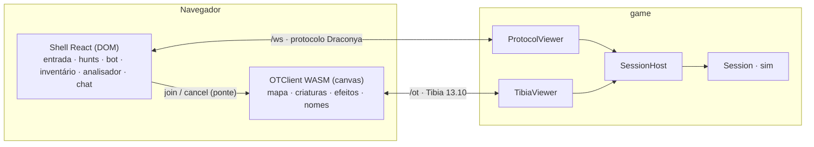

# Plano — adotar o cliente web do tibia-idle (OTClient em WebAssembly) no Draconya

**Status:** proposta, aguardando decisão. Nada aqui está implementado.
**Data:** 2026-09-10
**Natureza:** instantâneo. O que for decidido vira ADR (seção 10); o que for construído
vira `docs/product/` e `AGENTS.md` do pacote.

> **Atualização 2026-09-11.** Este plano foi escrito sobre a base `a3c34ce`. No mesmo dia a `main`
> recebeu sprites reais no Pixi, monstro no fio, efeitos/mísseis/dano flutuante, stats ao vivo,
> paredes por vizinhança e a HUD com skin do Tibia (FUN-23, 103, 105, 106, 108, 109). Duas coisas
> deste texto mudaram por isso e estão registradas na emenda do
> [ADR 0025](adr/0025-otclient-web-as-world-renderer.md): a versão recomendada passa a ser
> **13.32** (a tabela de aparências, o `things/` local e o staging já são 13.32, e a tag pública
> existe), e a régua da Fase 2 é o Pixi **de hoje**, não retângulos. O que segue está como foi
> escrito; as tarefas do milestone "OTClient web · teste local" já refletem a atualização.

Fontes examinadas, com commit, para que cada afirmação abaixo seja conferível:

| O quê | Onde | Versão |
|---|---|---|
| O cliente pedido | [`tibiazin-idle/tibia-idle`](https://github.com/tibiazin-idle/tibia-idle/tree/main/client), pasta `client/` | `main` em 2026-09-10 |
| A engine que ele executa | [`opentibiabr/otclient`](https://github.com/opentibiabr/otclient) (OTClient Redemption) | commit `dd56414`, 2026-08-15, **MIT** |
| Os assets que ele empacota | [`dudantas/tibia-client`](https://github.com/dudantas/tibia-client) | tag `13.10.12892`, commit `e020bd5` |
| O servidor que ele espera | TFS 1.6 (`v1.6`, `0986419`) ou o `backend/` Node do próprio repo | protocolo **13.10**, ambos **GPL-2.0** |
| O Draconya | este repositório | `a3c34ce` |

---

## 1. O que o "cliente" do tibia-idle é, de fato

A pasta `client/` tem **treze arquivos e 164 KB**, dos quais dois terços são fontes. O que ela
contém não é um cliente: é a **casca e a adaptação** de um cliente que vive fora do repositório.

```
client/browser/                 a página de entrada (DOM)
  shell.html        81 linhas   canvas + painéis de loading, login, personagens, erro
  entry.js         454 linhas   progresso do download, login HTTP, lista de personagens, ponte
  entry.css                     tema escuro, Cinzel + IBM Plex Sans (OFL, fontes incluídas)
client/modules/                 módulos Lua/OTUI carregados DENTRO da engine
  game_entry/      113 linhas   ponte navegador → engine: recebe `join`/`cancel`, chama loginWorld
  game_exploration/ 800 linhas  HUD própria: mapa em tela cheia, zoom 17×13, barras, painéis
```

O cliente de verdade é o **OTClient Redemption compilado para WebAssembly** com Emscripten
6.0.9 — C++20, Lua e OTUI, WebGL 2, pthreads, 1 GB de memória reservada — baixado por commit
para `vendor/` fora do Git e ajustado em build por scripts Python (`ops/prepare-client.py`,
`ops/browser/overlay.py`, `ops/local/overlay.py`). O upstream já traz a receita de build para
navegador (`Dockerfile.browser`, `browser/`, `src/framework/net/webconnection.cpp`); o tibia-idle
a fixa e a reproduz.

### 1.1 A cadeia inteira, ponta a ponta



1. **Download.** `otclient.data` leva os assets do Tibia 13.10 embutidos por `--preload-file`
   (`data/things/1310/`), mais o `init.lua` e todos os módulos. O Emscripten guarda o pacote
   em IndexedDB; a segunda visita lê do cache.
2. **Login HTTP.** `entry.js` faz `POST /login` com `{type:'login', email, password}` e recebe
   `{session:{sessionkey}, playdata:{characters, worlds}}` — o contrato do serviço de login da
   CipSoft, que o TFS 1.6 implementa e o OTClient espera.
3. **Ponte navegador → engine.** Não existe API JS↔Lua na engine: os dois lados trocam JSON por
   **arquivos no MEMFS** (`/tmp/tibia-entry-command.json` e `/tmp/tibia-entry-state.json`),
   cada um lendo o do outro a cada 100 ms. Comandos: `join` e `cancel`. Estados: `ready`,
   `connecting`, `online`, `error`, `logout`.
4. **Entrada no mundo.** `game_entry` chama
   `g_game.loginWorld('', '', world, host, port, character, '', sessionKey)` com protocolo
   1310. A engine abre `wss://host:porta` (**sem caminho** — `webconnection.cpp` monta a URL
   assim), recebe o desafio (`0x1F`) e manda o pacote de login: bloco RSA-1024 de 128 bytes
   com a chave XTEA, a `sessionKey` e o nome do personagem. Daí em diante todo pacote é
   `u16 tamanho | u32 sequência | XTEA(carga)`.
5. **Servidor.** O Websockify transforma WebSocket em TCP porque o TFS só fala TCP. O `backend/`
   Node do tibia-idle reimplementa o 13.10 em TypeScript — em 5/9/2026 cobria login, desafio,
   RSA/XTEA, entrada, mapa e movimento cardinal (~2.000 linhas em `backend/src/`).

### 1.2 O que ele adapta no upstream, e como

Oito arquivos, aplicados por expressão regular sobre o checkout fixado:

| Arquivo | Linguagem | O que muda | Interessa ao Draconya? |
|---|---|---|---|
| `init.lua` | Lua | `Servers_init` com a URL de login, carrega `game_exploration` e `game_entry`, locale `pt`, nome do app | sim, na forma |
| `modules/client_entergame/characterlist.lua` | Lua | força host/porta do mundo; desliga a lista legada no navegador | sim, na forma |
| `modules/game_features/features.lua` | Lua | **desliga `GameSequencedPackets` em 1310**, porque o TFS 1.6 usa checksum Adler | **não** — é exigência do TFS |
| `src/framework/net/protocol.cpp` | C++ | honra a flag acima no handshake | **não** — idem |
| `src/framework/net/webconnection.cpp` | C++ | `ws://` em vez de `wss://` no build local | sim, mas do jeito certo (§6.2) |
| `modules/game_containers/containers.lua` | Lua | recipientes abrem no painel flutuante da HUD | sim |
| `Dockerfile.browser`, `src/CMakeLists.txt` | build | `-j2`, caminhos do preload | sim, na forma |

### 1.3 O que ele **não** é

- **Não é um cliente TypeScript, React nem Vite.** O README deles é explícito: "Não há React ou
  Next.js". A interface é Lua/OTUI sobre uma engine C++.
- **Não traz sprite nenhum.** Os assets vêm de outro repositório, por tag, e são empacotados no
  build. É o mesmo pacote de arte — e o mesmo risco jurídico — que o
  [ADR 0008](adr/0008-tibia-client-assets-with-indirection.md) já assume.
- **Não fala o protocolo do Draconya.** Fala Tibia 13.10, com criptografia, sequência de login
  e descrição de mapa próprias. Quem quiser usá-lo precisa **falar 13.10 do lado do servidor**.
- **O login e a HUD são do TFS.** E-mail e senha contra MariaDB, lista de personagens no formato
  CipSoft, `THAIS - MUNDO ONLINE` fixo no topo. Nada disso encaixa no WorkOS, no ticket ou nos
  sistemas do Draconya (hunt, bot, analisador).
- **O `backend/` é GPL-2.0.** O `LICENSE` de `backend/` e de `server/` é a GPL v2 herdada do
  TFS. O código Node deles é referência de leitura, **nunca fonte de cópia** — a regra 1 do
  [ADR 0019](adr/0019-opentibia-as-domain-specification.md) vale aqui igual.

---

## 2. Por que vale a pena, e por que dói

**O que se ganha.** Um renderizador de Tibia completo e mantido: tiles com empilhamento, andares,
luz, outfits com cores e addons, animações por `frameGroups`, efeitos, mísseis, texto animado,
nomes e barras de vida, menu de contexto, recipientes, console de chat, zoom. Tudo que a
[FUN-23](https://linear.app/funkcaipora/issue/FUN-23) ainda teria de construir em Pixi — e mais
tudo que ela nem lista. A referência de interface do PRD (§5.2) é literalmente "OTClientV8"; este
cliente **é** um OTClient. O tibia-idle já validou a combinação engine + assets + flags
end-to-end no navegador (`docs/TELAS-DE-ENTRADA.md`, `docs/ETAPA-02-EXPLORACAO.md` deles), o
que vale mais que qualquer estimativa nossa.

**O que se paga.** Quatro coisas, em ordem de peso:

1. **O `game` precisa falar Tibia 13.10.** Não existe atalho: a engine só entende esse fio. É
   um codificador binário (framing, XTEA, RSA sem padding, descrição de mapa 18×14, criaturas,
   stats) e um decodificador de intenções. Escopo bem delimitado — cerca de 25 opcodes de saída
   e 15 de entrada para o MVP (§5) — e o tibia-idle prova que cabe em ~2.000 linhas de TS.
2. **Uma cadeia de build em C++.** Emscripten, vcpkg e dezenas de minutos por compilação limpa
   (mais de uma hora no builder de produção deles, com `-j2`). Não pode entrar no caminho do PR.
3. **Lua e OTUI passam a existir no repositório**, contra a letra do
   [ADR 0016](adr/0016-typescript-only-first-party-code.md). Precisa de exceção registrada,
   confinada, e verificada por ferramenta.
4. **Peso no navegador.** 1 GB de memória WASM reservada, WebGL 2 obrigatório, pthreads
   (portanto `SharedArrayBuffer`, portanto COOP/COEP na origem inteira) e ~126 MB na primeira
   carga. Não roda em boa parte dos celulares. O caminho sem engine precisa continuar existindo.

---

## 3. A decisão de forma: engine para o mundo, DOM para o resto

Há três jeitos de "usar esse cliente", e eles não são graus da mesma coisa.

| Forma | O que é | Veredito |
|---|---|---|
| **A. Tudo dentro da engine** — como o tibia-idle faz | HUD inteira em Lua/OTUI; hunt, bot e analisador chegam por opcodes estendidos e viram formulários OTUI | Descartada. Reescreve em Lua ~5.000 linhas de React já entregues e testadas (FUN-24, 79, 83, 89, 90, 97), numa linguagem em que o time não tem ferramenta, para telas que não existem no Tibia |
| **B. Só inspiração** — manter Pixi e copiar ideias | A casca de entrada, o zoom 17×13, a HUD flutuante como referência visual | Não é "usar o cliente". Continua sendo construir um renderizador do zero |
| **C. Engine desenha o mundo, DOM desenha o Draconya** | A engine ocupa o lugar do `Viewport` Pixi; o shell React continua em volta, com os mesmos painéis e o mesmo socket de hoje | **Recomendada** |

A forma C é a que respeita o que já existe dos dois lados:

- **Duas conexões, dois visualizadores da MESMA sessão.** O socket `/ws` de hoje continua
  levando ao shell React tudo que é do Draconya — `catalogue`, `inventory`, `bot-config`,
  `session-state`, `session-ended`, analisador. Um segundo socket, em 13.10, leva à engine só o
  que é **mundo**: mapa, criaturas, passos, vida, stats, chat, efeitos. O `SessionHost` já
  trata "duas abas do mesmo personagem" como dois visualizadores da mesma sessão
  (`packages/server/AGENTS.md`, FUN-13); este é o mesmo caso com dois protocolos.
- **A ponte JS↔Lua encolhe para quase nada.** No tibia-idle ela carrega login, lista de
  personagens e reconexão. Aqui o React já faz tudo isso (FUN-97); a ponte só precisa de
  `join`, `cancel` e o estado da engine.
- **O caminho sem engine é o caminho idle.** Celular, aba de fundo, WebGL indisponível: o shell
  React mostra hunt, analisador e bot sem o mundo. O invariante 3 já diz que a matemática não
  depende de ninguém olhar; isto é a apresentação seguindo a mesma regra.
- **A HUD do tibia-idle entra como base do que fica DENTRO do canvas**: nomes, barras de vida,
  console de chat, recipientes, menu de contexto, zoom. Barras de HP/MP em Lua e em React ao
  mesmo tempo é duplicação; a decisão por painel fica para a Fase 2 (§8), com a regra de que
  **cada informação tem um dono só**.



---

## 4. Onde cada coisa colide com o que o Draconya já decidiu

| Regra | Colisão | Como fica |
|---|---|---|
| **Invariante 1** (`sim/` puro) | nenhuma | O adaptador vive em `server` e `protocol`. `sim` não sabe que existe um segundo protocolo |
| **Invariante 2 e 3** (nada por tick; ninguém olhando) | nenhuma | A engine é apresentação. Efeito visual só é emitido quando há visualizador anexado, e não altera resultado |
| **Invariante 4** (só intenção) | O 13.10 tem opcodes de intenção (`Walk*`, `AutoWalk`, `Attack`, `UseItem`, `Talk`, `Look`) e opcodes que o Draconya não reconhece (mercado, party, VIP…) | O decodificador traduz os primeiros para `C2SMessage` (`walk`, `walk-to`, `say`, `logout`) e **descarta os demais com log**. Nada que chega pelo 13.10 carrega resultado |
| **Invariante 5** (opcodes só em `protocol/`, num arquivo) | Passa a existir uma segunda tabela de opcodes | Ela mora em `packages/protocol/src/tibia/opcodes.ts`, um arquivo, derivada para os dois sentidos. O "outro lado" é o upstream MIT — a fonte única do lado servidor continua sendo uma |
| **Invariante 6** (`content/` sem arte) | nenhuma | O engine consome o mesmo pacote `things/`, fora do repositório. `appearanceId`/`outfitId` viram `lookType`/id de item no fio |
| **Invariante 7** (versão fixada) | A engine carrega um pacote de assets; a sessão fixa uma versão de conteúdo | `welcome` passa a dizer qual pacote o conteúdo pressupõe; a casca recusa ligar a engine com pacote diferente. Melhor tela vazia com erro que criatura com sprite errado |
| **Invariantes 8, 9, 10** | nenhuma | O `TibiaViewer` nunca escreve estado quente; intenção vai para o mesmo `handle()` de hoje |
| [ADR 0007](adr/0007-react-pixi-client-external-store.md) (React + Pixi) | O mundo deixa de ser Pixi | Substituído em parte por ADR novo: **HUD em DOM fica**, store fora do React fica, "o canvas nunca renderiza através do React" fica mais verdadeiro ainda. O que sai é o viewport |
| [ADR 0016](adr/0016-typescript-only-first-party-code.md) (só TypeScript) | Lua e OTUI são código first-party | **Exceção pela regra que o próprio ADR prevê**: ferramenta externa que exige a linguagem. Confinada a `packages/client/engine/modules/`; `source-policy` passa a recusar `.lua`/`.otui` fora dali. `entry.js` **não entra como está**: vira TypeScript dentro do Vite. Os scripts Python de `ops/` **não entram**: o que deles for necessário é reescrito em `tools` |
| [ADR 0019](adr/0019-opentibia-as-domain-specification.md) (GPL é especificação) | O OTClient é MIT; o `backend/` do tibia-idle e o TFS são GPL v2 | Do OTClient pode-se copiar, mantendo o aviso. Do `backend/` e do TFS lê-se o **formato** — `docs/PROTOCOLO-1310.md` deles é o melhor resumo do handshake — e escreve-se do zero. Todo PR do adaptador cita a seção do `protocolgameparse.cpp` que o motivou |
| [ADR 0011](adr/0011-library-stack.md) (bibliotecas fixas) | RSA sem padding não existe no `node:crypto` | Exponenciação modular com `BigInt`, em TS puro, dentro de `protocol/tibia`. Sem dependência nativa, sem ADR de biblioteca |
| [ADR 0013](adr/0013-multi-architecture-images.md) (amd64 + arm64) | A engine é um build C++ | O artefato é `wasm32`, indiferente à arquitetura. O **builder** roda em qualquer uma (emsdk publica os dois). Nenhuma dependência nativa nova entra na imagem do `app` |
| [ADR 0022](adr/0022-coolify-same-origin-deployment.md) (origem única) | pthreads exigem `Cross-Origin-Opener-Policy: same-origin` e `Cross-Origin-Embedder-Policy: require-corp` | Cabeçalhos no Nginx do `web`. Todo recurso de outra origem precisa de CORP — o `.data` no R2 inclusive. Redirect do WorkOS é navegação, não subrecurso: não quebra |
| [ADR 0009](adr/0009-fixed-hunt-route-without-pathfinding.md) (rota fixa) | A engine tem pathfinding próprio e manda `AutoWalk` com o caminho | O caminho é **intenção**, e já existe `walk-to`. O servidor valida passo a passo como hoje (FUN-69). Na hunt quem anda é o bot; o clique no chão é modo manual |

---

## 5. O fio: o que o adaptador traduz

### 5.1 Handshake e admissão

O ticket do Draconya **cabe no campo `sessionKey`** do pacote de login 13.10. O
`sendLoginPacket` da engine, com a feature `GameSessionKey`, põe `string sessionKey` e
`string characterName` dentro do bloco RSA. O ticket tem 43 caracteres (`randomBytes(32)` em
base64url) e o bloco tem 128 bytes: sobram 58 bytes para o nome, que é mais que o limite de
nome de personagem.

A diferença em relação ao `/ws` de hoje: **o ticket chega depois do upgrade**, não na query
string. O `/ot` aceita o socket, manda o desafio (`0x1F`), espera o primeiro pacote com prazo
curto, decifra o RSA, consome o ticket pelo mesmo `tickets.consume(ticket, nodeId)` e só então
chama `host.attach`. Pacote antes do desafio, RSA que não começa em zero, ticket recusado:
fecha sem responder, como o TFS faz.

Sequência de saída que a engine exige para entrar no mundo, conferida no
`protocolgameparse.cpp` do commit fixado e reproduzida pelo tibia-idle (`player-entry.ts`):

| Ordem | Opcode | Nome no upstream | Do que sai no Draconya |
|---|---|---|---|
| 1 | `0x17` | `GameServerLoginSuccess` | id de criatura do próprio, velocidade, flags |
| 2 | `0x0A` | `GameServerLoginOrPendingState` | — |
| 3 | `0x0F` | `GameServerEnterGame` | — |
| 4 | `0x64` | `GameServerFullMap` | `session-state.world` + tilemap com camada visual (§6.1) |
| 5 | `0xA0` `0xA1` `0xA2` `0x9F` | stats, skills, estado, dados básicos | `player-stats`, `session-state.self` |
| 6 | `0xF5` `0x78` | inventário | `inventory` + `catalogue.items[].appearanceId` |
| 7 | `0x8D` `0x86` | luz, classes de item | constantes |

A ordem exata e os campos por versão são a primeira coisa que a Fase 0 (§8) fixa contra a
engine real, não contra a nossa leitura.

### 5.2 Servidor → engine

| Draconya (`S2CMessage`) | Tibia 13.10 | Observação |
|---|---|---|
| `session-state` | `FullMap 0x64` + um `0x61` por criatura | Reanexar na engine é logar de novo: o mapa vem inteiro, que é exatamente o que `session-state` já significa |
| `creature-appear` | `CreateOnMap 0x6A` com criatura `0x61` | `outfitId` → `lookType`; cores default até o §7.4 existir |
| `creature-move` | `MoveCreature 0x6D` | Passo do próprio também dispara a **fileira nova do mapa** (`0x65`–`0x68`) |
| `creature-disappear` | `DeleteOnMap 0x6C` | |
| `creature-health` | `CreatureHealth 0x8C` | |
| `player-stats` | `PlayerData 0xA0` | |
| `experience-gain` | `TextEffect 0x84` + `TextMessage 0xB4` | Só apresentação |
| `chat-message`, `say` | `Talk 0xAA` | |
| `system-message` | `TextMessage 0xB4` | |
| `session-ended`, drenagem | `SessionEnd 0x18` | A casca mostra o extrato pelo `/ws` |
| `pong` | `PingBack 0x1D` | |
| `instance-enter` | novo `FullMap` na posição nova | Transição de instância é um teleporte para a engine |
| `catalogue`, `inventory`, `bot-config-result` | **não vão** | São do `/ws` |

Posições: os mapas do Draconya são grades pequenas por instância; a engine espera coordenadas
absolutas `u16, u16, u8`. Cada instância recebe uma origem (`x + 1000·k`) e vive em `z = 7`.
A engine pede os oito andares de 7 a 0 no `FullMap`; os sete vazios saem como salto.

### 5.3 Engine → servidor

| Tibia 13.10 (`Client*`) | Draconya (`C2SMessage`) |
|---|---|
| `WalkNorth/East/South/West` `0x65`–`0x68`, diagonais `0x6A`–`0x6D` | `walk` (diagonal vira dois passos ou recusa — decisão da spec) |
| `AutoWalk 0x64` | `walk-to` com o último tile do caminho |
| `Stop 0x69`, `Turn* 0x6F`–`0x72` | ignorado / `turn` novo se a spec quiser |
| `Talk 0x96` | `say` |
| `Ping 0x1D`, `PingBack 0x1E` | `ping` |
| `LeaveGame 0x14` | `logout` |
| `Attack 0xA1`, `Follow 0xA2`, `UseItem 0x82`, `Look 0x8C`, `Move 0x78` | descartado com log até existir modo manual (E10) |
| `ExtendedOpcode 0x32` | canal reservado para o futuro (§9) |

---

## 6. Conteúdo, assets e a ponte com o que já existe

### 6.1 O mapa precisa de uma camada visual

Hoje `content/data/maps/*.json` é uma grade ASCII em que `#` bloqueia e o resto é livre
(`packages/content/AGENTS.md`). O viewport Pixi desenha retângulos; a engine desenha **itens**
— cada tile precisa de ao menos um chão, e as paredes de um item de parede. Proposta que
preserva o diff legível que o pacote defende:

```jsonc
{
  "id": "rat-cellars",
  "grid": ["#####", "#...#", "#####"],
  "legend": {                       // caractere → pilha de appearanceId, do chão para cima
    ".": [4526],                    // chão de pedra
    "#": [4526, 1050]               // chão + parede
  }
}
```

A legenda respeita o invariante 6 (id, nunca arquivo) e entra na versão de conteúdo. O
`isBlocked` continua vindo de `#`; a legenda é só apresentação. Importar mapas OTBM de verdade
(a "ferramenta de importação de tilemap" da FUN-9) vira uma segunda fonte para a mesma forma,
depois.

### 6.2 Fixar uma versão de pacote e de protocolo, uma só

Hoje as duas pontas não concordam: `.env.example` diz `THINGS_VERSION=1332` e a tabela de
aparências diz `"pack": "tibia-1332"`, enquanto o tibia-idle validou **13.10** (`13.10.12892`).
Os layouts de pacote mudam entre versões; escolher é obrigatório, e a escolha é do plano:

**Recomendação original: 13.10** — a única combinação engine + assets + flags validada
end-to-end pelo tibia-idle, com o custo de remapear uma tabela de duas linhas.
**Revisada em 2026-09-11 para 13.32** (emenda do ADR 0025): a tabela cresceu para dezenas de ids
13.32, o pacote 13.32 é o que está nas máquinas e no staging, e existe tag pública
(`dudantas/tibia-client@13.32.14520`). A validação que o tibia-idle fez para o 13.10 é substituída
pelo spike da Fase 0, que valida a versão escolhida contra a engine real.

### 6.3 O que acontece com o pipeline de assets em TypeScript (FUN-16 a FUN-20)

Não é jogado fora, mas muda de papel. A engine lê o pacote sozinha (`data/things/<versão>/`
dentro do `otclient.data`), então o decoder LZMA, o fatiador e o cache em IndexedDB deixam de
estar no caminho de render. O que continua valendo, e onde:

- `assets/appearances.ts` + `catalog.ts` viram a base da **validação da FUN-21** — cruzar a
  tabela de aparências e as legendas de mapa contra o pacote, em `tools`, antes do deploy.
- `assets/outfit.ts` (paleta de 133 cores) confirma que as cores mandadas no `0x61` são as
  que a engine vai pintar.
- `world/viewport.ts`, `world/camera.ts` e `state/world.ts` **saem** depois que a engine
  entrar (Fase 3). Manter dois renderizadores é manter dois conjuntos de defeitos. A decisão
  de manter o Pixi como modo "leve" para celular fica aberta (§10) e, se for tomada, é ADR.

### 6.4 A [FUN-103](https://linear.app/funkcaipora/issue/FUN-103) é pré-requisito de qualquer cliente

O servidor não manda monstro para o fio. Com engine ou com Pixi, a adega aparece vazia. Ela
entra na Fase 2 como bloqueio, não como paralelo.

---

## 7. Build, empacotamento e distribuição da engine

### 7.1 Onde mora

```
packages/client/engine/
  engine.lock.json      upstream (repo + commit), assets (repo + tag + commit), emsdk, vcpkg,
                        e o sha256 de cada artefato publicado
  patches/*.patch       o mínimo de C++/Lua do upstream que precisa mudar, com `git apply`
  modules/game_entry/   a ponte, reduzida a join/cancel/estado
  modules/game_hud/     o que ficar da HUD do tibia-idle (nomes, barras, console, recipientes)
  Dockerfile            o builder: ubuntu 24.04 + emsdk 6.0.9 + vcpkg fixado, mesmo do upstream
packages/client/src/engine/
  loader.ts             o `Module` do Emscripten: `locateFile`, progresso, sonda de WebGL 2
  bridge.ts             a ponte por MEMFS, tipada
  EngineViewport.tsx    monta o canvas no lugar do `Viewport` Pixi
packages/protocol/src/tibia/
  opcodes.ts            a tabela (invariante 5), um arquivo
  packet.ts framing.ts xtea.ts rsa.ts   primitivas puras, sem `node:*`
  encode.ts decode.ts   S2CMessage → pacotes; pacotes → C2SMessage
packages/server/src/game/
  tibia-viewer.ts       o segundo visualizador; mesma interface do `Viewer`
  tibia-route.ts        `/ot`: desafio, primeiro pacote, ticket, attach
packages/tools/src/engine/
  repack.ts             troca módulos Lua dentro do `otclient.data` sem recompilar
  check.ts              confere índice, tamanhos e hashes do pacote publicado
packages/tools/src/tibia/
  client.ts             cliente sintético 13.10: handshake + parser de mapa, para teste
```

Patches em vez de fork: são poucos, ficam legíveis no PR e `engine.lock.json` diz exatamente
sobre qual commit se aplicam. Se crescerem, fork com branch é o próximo passo, e é ADR.

### 7.2 O que muda no upstream, e o que NÃO muda

- **Não** desligar `GameSequencedPackets` nem tocar `protocol.cpp`: são exigências do TFS
  1.6. O Draconya escreve o servidor, então segue o padrão do upstream (sequência, não
  checksum).
- **`webconnection.cpp`**: em vez de trocar `wss://` por `ws://` no build local, fazer o
  esquema seguir o da página e aceitar um **caminho** (`/ot`). Assim o Nginx roteia por
  caminho como faz com `/ws`, e o mesmo binário serve dev e produção. É patch pequeno e
  candidato a ir para o upstream.
- **Ponte**: começa com os arquivos no MEMFS, que funcionam sem tocar em C++. Um binding
  `postMessage` de ~50 linhas em C++ substitui o polling de 100 ms quando isso incomodar; não
  antes.

### 7.3 Ciclo de vida do artefato

1. **Compilar é raro; empacotar é comum.** O `.wasm` só muda quando `engine.lock.json` ou um
   patch muda. Módulos Lua e a casca mudam toda semana — e o tibia-idle mostra que dá para
   trocá-los reescrevendo só o índice `loadPackage` dentro do `otclient.js` (`repack.py`,
   portado para `tools/engine/repack.ts`).
2. **Um workflow próprio compila a engine** — `workflow_dispatch` ou gatilho por mudança em
   `packages/client/engine/{engine.lock.json,patches,Dockerfile}` — e publica
   `otclient.{js,wasm,data}` com o hash no nome num bucket do R2. Roda em dezenas de minutos e
   **não está no caminho do PR**: os três checks de hoje continuam custando o que custam.
3. **O build do `web` baixa o artefato pelo hash** que está no lock, aplica o repack com os
   módulos do commit e confere com `check.ts`. Hash que não bate derruba o build.
4. **Servir:** `otclient.js` e `.wasm` na imagem `web`; o `.data` (~126 MB) no R2, com
   `Cross-Origin-Resource-Policy: cross-origin` e cache longo pelo hash, apontado por
   `locateFile`. O `infrastructure.md` já reserva o R2 para isso — egresso zero é o que torna
   126 MB por jogador novo uma conta que não cresce.
5. **Nginx:** COOP/COEP em `location /`, e `location /ot` com o mesmo upgrade e timeout do
   `/ws`.

### 7.4 Teste

- **Unitário, sem engine**: `protocol/tibia` tem ida e volta de framing, XTEA e RSA contra
  vetores independentes; `encode.ts` é comparado com o parser do cliente sintético.
- **Integração, sem navegador**: o cliente sintético 13.10 em `tools` faz o handshake contra o
  `game` de teste, entra, recebe o mapa e vê o rato aparecer e andar. É o teste de contrato do
  adaptador, no mesmo espírito do `phase-one-exit.test.ts`.
- **Fumaça, com engine real**: Chromium headless com SwiftShader carrega a casca, liga a
  engine, entra com ticket e tira uma captura. Roda no workflow da engine e no deploy de
  staging, não por PR.

---

## 8. Fases

Cada fase tem um critério de saída observável. Nenhuma depende de decisão pendente da seguinte.

### Fase 0 — provar o fio (spike, uma issue)

Rodar o `otclient.{js,wasm,data}` **já publicado pelo tibia-idle** contra um servidor 13.10
descartável escrito em TS em `tools`, que responde o desafio, decifra o login, e manda um mapa
fixo de 5×5 com uma criatura. Nada toca `game`.

**Sai quando:** a engine entra no mundo a partir de um ticket falso e mostra o mapa fixo. O
resultado da fase é a **lista fechada de opcodes, campos e ordem** que a engine exigiu — o que a
spec da Fase 1 usa em vez de leitura de código.

### Fase 1 — o `game` fala 13.10 (M2 · Mundo visível)

- `protocol/tibia`: opcodes, primitivas, `encode`/`decode` do conjunto da §5.
- `server/game`: `TibiaViewer`, rota `/ot`, admissão por ticket dentro do RSA.
- `content`: legenda visual nos dois mapas; pacote e protocolo fixados (§6.2).
- `client`: `loader.ts`, `bridge.ts`, `EngineViewport.tsx` no lugar do `Viewport`; a casca
  React pede o segundo ticket e manda `join`.
- `packages/client/engine`: lock, patch do `webconnection.cpp`, `game_entry` reduzido,
  `game_hud` com a HUD do tibia-idle como está.

**Sai quando:** entrar pela tela de hoje (WorkOS + personagem) mostra a Cidade na engine, o
personagem anda pelas setas e pelo clique, outro personagem na praça aparece e anda, fechar e
reabrir a aba volta ao mesmo lugar sem passar por login. O `/ws` continua funcionando igual.

### Fase 2 — a hunt na tela

- [FUN-103](https://linear.app/funkcaipora/issue/FUN-103): monstro no fio, com `outfitId` real.
- `creature-health`, `experience-gain` e morte como efeito e texto na engine.
- Decisão por painel: o que fica em Lua (dentro do canvas) e o que fica em React. Regra: cada
  informação tem um dono.
- Transição Cidade → hunt → Cidade como teleporte na engine, com o extrato chegando pelo `/ws`.

**Sai quando:** o roteiro do `phase-two-exit.test.ts` — entrar na hunt, ver o rato morrer, sair
com extrato — acontece **na tela**, e o cliente sintético 13.10 afirma a mesma sequência sem
navegador.

### Fase 3 — operação e a saída do Pixi

- Workflow de build da engine, artefato no R2 por hash, repack no build do `web`, COOP/COEP e
  `/ot` no Nginx, fumaça headless no staging.
- Caminho sem engine: celular e WebGL indisponível caem no shell React sem mundo, com aviso.
- Remoção de `world/viewport.ts`, `camera.ts` e `state/world.ts`; o pipeline de assets vira
  ferramenta de validação (FUN-21).
- `AGENTS.md` do `client`, `docs/product/` e este plano fechados no que foi construído.

**Sai quando:** o staging entrega a engine a partir de um PR sem compilar C++, e o `pnpm check`
recusa `.lua` fora de `packages/client/engine/modules/`.

### Fase 4 — o que a engine permite e o Pixi nunca permitiria

Cores de outfit (§7.4 do PRD) no `0x61`; opcodes estendidos para nome de hunt e alvo do bot
sobre a criatura; modo manual (E10) traduzindo `Attack`, `UseItem` e `Move`; ponte por
`postMessage`. Nada disso tem data; cada item é issue própria, puxada por necessidade
(regra 3 do ADR 0019).

---

## 9. Riscos e o que não fazer

- **Copiar do `backend/` do tibia-idle.** É GPL v2. A tentação é grande porque o código é
  pequeno e resolve exatamente o problema. A resposta é a mesma do ADR 0019: ler o formato,
  escrever o nosso, citar a fonte do upstream MIT.
- **Deixar a compilação da engine entrar no CI de PR.** Uma hora de build é o passo que ensina
  a não esperar o CI. O artefato por hash existe para isso.
- **Confiar no polling de 100 ms como arquitetura.** É o que existe sem tocar em C++, e basta
  para `join`/`cancel`. Qualquer coisa com latência perceptível — alvo, hotkey — pede o
  binding.
- **Fazer a engine obrigatória.** 1 GB de memória e WebGL 2 excluem aparelhos. O jogo é
  idle-first; o shell sem mundo é um modo legítimo, não uma degradação.
- **Redistribuir o `.data` sem lembrar o que ele contém.** São os assets do Tibia empacotados
  num arquivo só, servidos a todo jogador. É o mesmo risco jurídico do ADR 0008, agora num
  formato mais fácil de apontar. A decisão de produto que aceitou o risco continua sendo a
  mesma; vale nomear que a superfície mudou.
- **Deixar o upstream andar sozinho.** O commit fixado é de agosto de 2026 e o projeto muda
  toda semana. Atualizar é: subir o lock, reaplicar patches, recompilar, rodar a fumaça. Nunca
  "pegar o último".
- **Manter dois renderizadores "por enquanto".** O Pixi sai na Fase 3 ou vira decisão escrita.

---

## 10. O que precisa ser decidido antes da Fase 1

Quatro perguntas, cada uma com a recomendação deste plano. As respostas viram o **ADR 0025**
("OTClient em WebAssembly como renderizador do mundo"), que substitui em parte o ADR 0007 e
emenda o ADR 0016.

| Pergunta | Recomendação | O que muda se for o contrário |
|---|---|---|
| Versão de pacote e protocolo: 13.10 ou **13.32**? | 13.32 (§6.2, revisada em 2026-09-11) | Voltar a 13.10 é trocar o lock e remapear a tabela de aparências |
| HUD do Draconya: DOM (forma C) ou Lua (forma A)? | DOM | Reescrever cinco telas em OTUI; ponte carrega dados de HUD |
| Upstream: patches sobre commit fixado, ou fork? | patches | Fork exige repositório e processo de rebase próprios |
| Pixi: sai na Fase 3, ou fica como modo leve? | sai | Dois renderizadores, dois conjuntos de defeitos, um ADR dizendo por quê |

O que este plano **não** decide, de propósito: balanceamento, telas novas, nada de produto. É um
plano de motor de apresentação — a hunt continua rodando exatamente igual com o navegador
fechado, que é a única coisa que não pode mudar.

---

## 11. Referências

- Cliente: [`tibiazin-idle/tibia-idle/client`](https://github.com/tibiazin-idle/tibia-idle/tree/main/client);
  `docs/TELAS-DE-ENTRADA.md`, `docs/ETAPA-02-EXPLORACAO.md`, `docs/STACK.md` e
  `docs/PROTOCOLO-1310.md` do mesmo repositório.
- Engine: [`opentibiabr/otclient`](https://github.com/opentibiabr/otclient) — `Dockerfile.browser`,
  `browser/`, `src/framework/net/webconnection.cpp`, `src/client/protocolcodes.h`,
  `src/client/protocolgamesend.cpp` (`sendLoginPacket`), `src/client/protocolgameparse.cpp`.
- Draconya: [`technical-architecture.md`](technical-architecture.md) §13 e E14,
  [`architecture.md`](architecture.md) §8, [`boundaries.md`](boundaries.md),
  [`deploy.md`](deploy.md), [`infrastructure.md`](infrastructure.md),
  [`packages/client/AGENTS.md`](../packages/client/AGENTS.md),
  [`packages/server/AGENTS.md`](../packages/server/AGENTS.md),
  [`packages/protocol/AGENTS.md`](../packages/protocol/AGENTS.md).
- Issues tocadas: [FUN-23](https://linear.app/funkcaipora/issue/FUN-23) (pausa: o viewport Pixi
  deixa de ser o destino), [FUN-103](https://linear.app/funkcaipora/issue/FUN-103) (bloqueio da
  Fase 2), [FUN-21](https://linear.app/funkcaipora/issue/FUN-21) (vira validação em `tools`),
  [FUN-65](https://linear.app/funkcaipora/issue/FUN-65) (o pacote de assets continua sendo
  pré-requisito — agora do build da engine).
