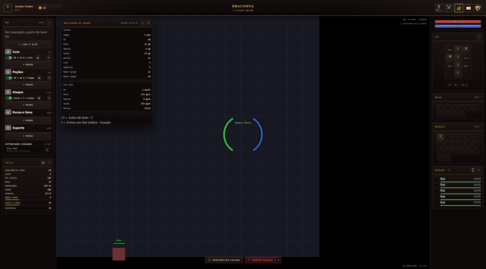

# Paridade do HUD com a imagem — auditoria de 2026-09-18

Evidência do [ADR 0032](../adr/0032-the-rendered-hud-is-the-game-contract.md) e do
[plano do contrato do HUD](../hud-contract-plan.md). Cliente auditado: `main` no commit `700ec7e`
(M14–M17, M15 revisado e M19 mesclados). A imagem-alvo é
[kit-reference/10-hud-hunt.png](../kit-reference/10-hud-hunt.png).

## 0. O HUD de hoje

Captura de 2000 × 1108 do cliente em `localhost:5174`, personagem level 2 numa Rat Cellars
"Ousado", Chrome headless (por isso o mundo aparece sem tiles: sem WebGL o canvas não pinta; o HUD
em DOM é o que interessa). Para refazer: subir servidor e cliente numa worktree limpa (ver a memória
de QA do projeto: `.env` com `API_ORIGIN=http://localhost:5174`, banco próprio migrado com
`packages/server/src/db/migrate.ts`, `things` como symlink), `POST /api/auth/dev-login` disparado da
origem do cliente, entrar com o personagem e capturar com `puppeteer-core` apontando para o Chrome
do sistema, viewport 2000 × 1108, `deviceScaleFactor: 1`.

O que salta aos olhos contra a imagem: a coluna esquerda tem o painel **BOT** v1 (categorias,
"Lure e alvo", "Configurações avançadas · Ring swap") e não as **Automações**; **não há barra de
ações** e o mundo vai até o rodapé; a coluna direita não tem **postura**, a **Bolsa** é uma grade
vazia e a **Mochila** mostra um sprite sem rótulo nem contagem; o topo não tem gemas, Loja nem os
ícones de Guild/Amigos/Prey/Configurações. O resto (vitais, equipamento, Batalha, overlays do
mundo, Skills, Party) está próximo, com as diferenças da tabela do plano §1.2.

Os três levantamentos abaixo foram feitos por agentes de leitura sobre o mesmo commit e revisados
pelo orquestrador; a transcrição da imagem que eles receberam é a seção A.0.

---

# A. A imagem-alvo, transcrita

---

# B. O cliente, região a região

---

# C. O modelo de jogo, sistema a sistema

---

# D. As decisões vigentes e o que a imagem faz com elas

> Nota do orquestrador: este levantamento lê o ADR 0030 como "já confirmado pela imagem". O ADR 0032
> discorda na parte que importa — o 0030 deixou o modelo de jogo decidir o que aparece (omitir,
> configuração sem disparo, postura inerte, P1–P5 pendentes) — e é isso que ele emenda. A tabela
> continua útil como inventário do que cada ADR diz.

# A. A imagem-alvo, transcrita

TOPO (65 px): [avatar "A"] "ALDRIC FERRO / CAVALEIRO · LV 200" | pill dourada "2.134.760 (+)" | pill "120" com gema vermelha | botão "LOJA" (com ícone) | centro "DRACONYA / 1.284 PLAYERS ONLINE" | direita: 10 ícones quadrados (personagem, espadas, gráfico/analisador, livro, escudo, party, medalha/guild, mapa, bolsa/loja?, engrenagem).

COLUNA ESQUERDA (232 px), três seções colapsáveis:
- SKILLS [engrenagem][−]: linhas rótulo/valor: Experiência total 62.414.192; Level 200 (barra dourada); Hit Points 3.165 (valor vermelho); Mana 785 (valor azul); Soul Points 9; Capacidade 3.715; Speed 334; Stamina 41:40; Magic Level 5 (barra azul); Sword Fighting 42 (barra dourada); Shielding 29 (barra dourada).
- AUTOMAÇÕES [−]: 5 linhas, cada uma = toggle + título + subtítulo pequeno + [engrenagem][×]:
  1. "Renovar anel" / "Life Ring · quando acabar" (ligada)
  2. "Renovar colar" / "Dragon Necklace · quando acabar" (ligada)
  3. "Trocar arrow por alvos" / "≥ 3 alvos → Burst Arrow · senã…" (DESLIGADA, esmaecida)
  4. "Trocar arma/escudo por v…" / "HP < 50% → Shield + Espada · H…" (ligada)
  5. "Swap ring · Energy Ring" / "HP < 60% ou ≥ 4 alvos · volta …" (ligada)
  Botão largo "+ ADICIONAR".
- PARTY · 5 [ícone-janela][engrenagem][−]: por membro: nome + sigla de vocação + "LV n" à esquerda, "Gasto: 54.115" à direita; barra HP vermelha e barra MP azul; linha "DPS 723 · 135.7k" (esq) / "HPS 107 · 20.2k" (dir). Membros: "• você RP LV 272"; "Caiporinha ED LV 261" (×); "Hanum MS LV 224" (×); "Sucuri Goza EK LV 206" (×); "Ablablinbleu MS LV 211" (×). Rodapé: "Gasto médio do grupo  23.634 gp"; "Sua parte  recebe 30.481 gp" (verde); nota "Parar no meio da caçada exige o sim de todos."; toggle "Rateio de custos" (ligado); toggle "Dividir loot" (desligado); botão vermelho largo "SAIR DA PARTY".

MUNDO (centro, canvas): pill verde "EXP +64% 18h" (canto sup. esq.); pill dourada "Bênção ativa" (canto sup. dir.) e abaixo "COVIL DOS DRAGÕES · OUSADO / 4 CRIATURAS NO ALCANCE"; criaturas com nome verde + barra de vida: Fire Devil, Dragon, Dragon Lord (MOLDURA VERMELHA = alvo atual), Dragon Hatchling; o jogador "Aldric Ferro" ao centro com dois arcos (HP verde à esquerda, MP azul à direita); canto inf. esq.: pills de buff "Haste 2:14", "Utamo Vita 0:48", "Magic Shield 1:31" (cada com ícone colorido); centro inferior: botões "ⓘ DETALHES DA CAÇADA", "DESPACHAR LOOT »", "SAIR DA CAÇADA »" (vermelho), com a legenda acima "Saindo sozinho: acabar o gold · alguém do grupo sair"; canto inf. dir.: "● 42 MS  60 FPS".

BARRA DE AÇÕES (rodapé, ~124 px, entre as colunas): cabeçalho "AÇÕES" à esquerda e "Salva automaticamente" à direita. Duas fileiras de 12 slots (36 px):
- Fileira 1 (magias): [EXORI] [EXORI GRAN] [EXORI MIN] [HASTE] (roxo, nº 3?) [ESCUDO] (nº 5) [CURA] (verde, nº 6) + 6 slots vazios com "+". Alguns slots têm um número pequeno no canto (tecla de atalho: 1…6).
- Fileira 2 (itens/consumíveis, com CONTAGEM): [MANA 160] [VIDA 158] [SD 50] [BENÇÃO 0] [COMIDA 12] [F1 (vazio)] + 5 vazios.
À direita da grade: "CONJUNTO [Energia ▾]" (dropdown); "ALVO [Seguir Dragon Lord ▾]" (dropdown); botão "⊕ LURE · FOLLOW"; legenda "MIN 4 · MAX 8 / SEGUIR ALVO".

COLUNA DIREITA (232 px):
- Barra HP vermelha "3.165 / 3.165" e barra MP azul "785 / 1.000" (com o número centralizado).
- Grade de equipamento (slots com rótulo em maiúsculas dentro): linha 1 PESCOÇO, CABEÇA, MOCHILA; linha 2 MÃO, PEITO, ESCUDO; linha 3 DEDO, PERNAS, MUNIÇÃO; linha 4 PÉS (centro).
- "CAP  612 / 3.715 oz".
- Postura: três botões [DEFENSIVA] [BALANCEADA (selecionada, dourada)] [ATACANTE], com ícone em cima do texto.
- BOLSA [−]: slots com rótulo + contagem: GOLD 8.4k, PLAT 12, GEM 3 + 3 vazios.
- MOCHILA [−]: UH 150, MP 160, SD 58, F-RING 4, L-RING, FOOD 12, ARROW 900, BURST 300 + slots vazios.
- BATALHA · 4 [⇕][−]: lista: Dragon 100%, Dragon Lord 72% (moldura vermelha = alvo), Dragon Hatchling 30%, Fire Devil 91%; cada linha com ícone quadrado, nome, % e barra verde.

---

# B. O cliente, região a região

**Checkout auditado:** `main` no commit `700ec7e` (worktree `hud-contract-plan`), só leitura.
**Alvo:** a transcrição da seção A (descrição textual) + `docs/kit-reference/10-hud-hunt.png`
(captura renderizada, 1800×1010) + `docs/kit-reference/README.md` (proveniência e ressalvas).
**Plano/auditoria já existentes, usados como evidência cruzada:** `docs/kit-fidelity-plan.md`
(M16/M17 fechados, M18 ainda **não aberto** — issue-portão #362 não tem commit nenhum no log) e
`docs/reviews/kit-fidelity-audit-2026-09-16.md` (mapa de capacidade do protocolo, pré-M16/M17,
conferido de novo aqui contra o código atual onde citado).

Convenção de status: **existe** (peça e dado batem ou batem a menos de formatação/nome),
**parcial** (peça está lá mas falta contagem/campo/comportamento do alvo), **ausente** (nada
renderiza aquilo hoje).

---

## 1. TOPO (65 px)

| Elemento | Status | Componente (arquivo:linha) | Fonte do dado | Diferença vs imagem | Motivo/observação |
|---|---|---|---|---|---|
| Retrato "A" do personagem | existe | `packages/client/src/shell/TopBar.tsx:139-149` (`selfOutfit`, linha 63-68) | `world.selfId` + `world.creatures` (outfit/cores do `creature-appear`/`session-state`) | Nenhuma relevante | Cai para a inicial do nome enquanto a criatura própria não chegou |
| Nome + "VOCAÇÃO · LV n" | existe | `TopBar.tsx:150-156` | `state.characterId`→`account` store (nome); `state.vocationId`+`catalogue.vocations` (nome); `state.level` | Nenhuma | — |
| Pill dourada de gold "2.134.760 (+)" | **parcial** | `TopBar.tsx:157-160` | `state.gold` (`player-stats`) | Sem o botão **"+"** (abrir Loja/comprar gold) | Loja (E13) não existe como sistema no cliente |
| Pill "120" com gema vermelha | **ausente** | — | — | Nada renderiza gemas/cristais | `account.coins` existe como coluna inerte no banco (audit), sem opcode nem tela — E13 |
| Botão "LOJA" | **ausente** | — | — | — | Épico E13 (Monetização/Market) não iniciado |
| Wordmark "DRACONYA" + "N players online" | existe | `TopBar.tsx:162-167` | `state.onlinePlayers` (`player-count`/`session-state.onlinePlayers`) | Texto "players online" minúsculo vs. maiúsculo do kit — cosmético | "—" enquanto `null`, nunca `0` inventado (D8) |
| 10 ícones à direita | **parcial** (5 de 10) | `TopBar.tsx:47-53` (`WINDOWS`), `NavIcon` linha 75-106 | fixo no código, abre `open.<id>` | Só **Personagem, Hunts, Analisador, Cyclopedia, Chat**. Faltam: Guild, Party (ícone dedicado), Amigos/Social, Prey, Loja, Configurações | RC-09/#322: cada ícone que falta espera o sistema atrás dele existir (E12 Guild, E7 Prey, E13 Loja, social sem épico, Configurações sem endpoint). Comentário linha 10-13 do próprio arquivo lista a decisão |

---

## 2. COLUNA ESQUERDA (232 px)

### 2a. SKILLS

| Elemento | Status | Componente (arquivo:linha) | Fonte do dado | Diferença vs imagem | Motivo/observação |
|---|---|---|---|---|---|
| Painel colapsável com engrenagem | existe | `packages/client/src/shell/SkillsPanel.tsx:118-140` (`Panel dock`, `actions` com `IconButton` "⚙") | — | Nenhuma | Engrenagem abre `SkillsCustomizeModal` (linha 44-76), fiel ao kit v3 (checkboxes 2 colunas, "N de M visíveis", Padrão/Salvar) |
| Experiência total | existe | `SkillsPanel.tsx:99` (`values.exp`) | `state.xp` (`player-stats`/`session-state.self`) | Nenhuma | — |
| Level (barra dourada) | **parcial** | `SkillsPanel.tsx:100`, `StatRow` sem `percent` para `level` | `state.level` | Sem a barra de progresso dourada até o próximo level | **Decisão de produto explícita de não expor** — `packages/protocol/src/types.ts:359-364` (comentário citado pela auditoria): a curva de XP não vai ao catálogo de propósito, para não virar métrica comparável entre hunts |
| Hit Points (valor vermelho) | existe | `SkillsPanel.tsx:82,101`, tom `vital-hp` via `TONE_BY_ID.hp` (linha 33) | `state.health` (`player-stats`) | Nenhuma | throttle 100 ms |
| Mana (valor azul) | existe | `SkillsPanel.tsx:83,102`, tom `vital-mp` | `state.mana` | Nenhuma | — |
| **Soul Points 9** | **ausente** | — | — | Linha inteira não existe | **Mecânica inexistente em nenhuma camada** — confirmado por grep (`content`/`sim`/`server`/`protocol` sem "soul"); precisa decisão de design via `/product` antes de qualquer código (`docs/kit-fidelity-plan.md` tabela de épicos) |
| Capacidade 3.715 | existe | `SkillsPanel.tsx:84,103` | `state.capacity` | Formato `"3.715 oz"` — bate | — |
| Speed 334 | existe | `SkillsPanel.tsx:86,104` | `state.speed` (`PlayerStats`) | Sem barra (o kit também não desenha barra para Speed) | Chegou com SV-04/#346 |
| Stamina 41:40 | existe | `SkillsPanel.tsx:85,105`, `staminaClock` em `skills-preference.ts:54-59` | `state.staminaMs` | Nenhuma | Formato `h:mm` |
| Magic Level 5 (barra azul) | existe | `SkillsPanel.tsx:87,106,113` | `state.skills.magic` (`{level, percent}`) | Nenhuma | Tom `vital-mp` (linha 35) |
| **Sword Fighting 42** (barra dourada) | **diferente** | `SkillsPanel.tsx:107` mostra `skills.melee.level` sob o rótulo **"Corpo a Corpo"** | `state.skills.melee` | O jogo modela **uma skill de melee genérica**, não por família de arma (sword/axe/club como no Tibia) | `packages/client/src/state/hud.ts:218-222` só tem `melee`/`distance`/`magic`; não há schema de skill por arma em `packages/content` — granularidade é decisão de design, não lacuna de transporte |
| **Shielding 29** (barra dourada) | **ausente** | — | — | Não existe linha nem skill "shielding" | Confirmado: nenhum `Skill` de shielding em `packages/sim/src/skills.ts` nem em `packages/content/data/skills`; o painel mostra **Distância** (`SkillsPanel.tsx:108`, `skills.distance`) no lugar — rótulo e mecânica diferentes do alvo |

Preferência de linhas visíveis é só de tela (`localStorage`, `skills-preference.ts:23`), nunca
estado de jogo — 10 linhas hoje (`SKILL_ORDER`, `skills-preference.ts:4-6`) contra as 11 do alvo.

### 2b. AUTOMAÇÕES

| Elemento do alvo | Status | Componente (arquivo:linha) | Fonte do dado | Diferença vs imagem | Motivo/observação |
|---|---|---|---|---|---|
| Painel "AUTOMAÇÕES" com 5 linhas nomeadas (Renovar anel, Renovar colar, Trocar arrow por alvos, Trocar arma/escudo por vida, Swap ring) | **ausente como tal** | `packages/client/src/shell/BotPanel.tsx:156-251` (existe um painel, mas chamado **"Bot"**, `Panel title="Bot"` linha 198) | `BotConfig` (`bot/store.ts`) | O painel hoje agrupa regras **genéricas condição→ação** por 5 CATEGORIAS técnicas: `heal, potion, attack, rune, support` (`packages/content/src/schemas.ts:1594`, `CATEGORY_TEXT` em `BotPanel.tsx:41-47`: Cura/Poções/Ataque/Runas e itens/Suporte), não as 5 automações nomeadas do kit | O vocabulário "automações nomeadas" (renovar por carga, trocar munição por nº de alvos, trocar arma/escudo por HP) é escopo do **M18** (`docs/kit-fidelity-plan.md` §M18), que **não abriu** — issue-portão #362 sem commit no repo |
| Toggle liga/desliga por regra | existe (para as regras genéricas) | `BotPanel.tsx:52-80` (`RuleRow`, `Switch tone="traffic"`) | `bot/store.ts` (`toggleRule`) | Layout é `[switch] texto → ação [⚙][▴▾][×]` numa linha só, sem subtítulo pequeno em 2 linhas como o alvo | — |
| Botão "+ ADICIONAR" largo | **parcial** | `BotPanel.tsx:116-120` mostra "+ regra" por CATEGORIA (dentro de cada seção), não um botão único no rodapé do painel | — | Nome e posição diferentes; não existe `AddAutomationModal` (capturado em `docs/kit-reference/35-modal-add-automation.png`) | M18 |
| Swap ring como automação da lista | **existe, mas fora da lista** | `BotPanel.tsx:127-148` (`AdvancedSection`) abre `RingSwapModal.tsx` por um botão "⚙" numa seção "Configurações avançadas · LV 50+", não uma linha com toggle igual às outras | `BotConfig.ringSwap` | Mecanismo (`#applyRingSwap`) já roda no `sim` (comentário `RingSwapModal.tsx:1-2`); só a apresentação como "automação padrão" falta | `docs/kit-fidelity-plan.md`: "SV-16/SV-17 continuam no M15 e são pré-requisito da automação 'Swap ring' [do M18]" |
| Trocar arrow por alvos / arma-escudo por HP | **ausente** | — | — | Nenhuma tela liga nº de alvos ou HP a troca de munição/equipamento | Exige estoque contável de munição (decisão de produto **P1**, ainda não confirmada — `docs/kit-fidelity-plan.md` §3) |
| "Renovar anel/colar por carga" | **ausente** | — | — | — | Exige consumir `charges`/`durationMs`, hoje mortos no `sim` (nota do plano, M18) |
| Lure e alvo (⌖) | existe, mas em outro lugar | `BotPanel.tsx:204-206` botão "⌖ Lure e alvo" abre `LureTargetingModal.tsx` (modal cheio, 620 px) | `bot/store.ts` (`draft.lure`, `draft.targeting`) | No alvo isso é a barra de ações (CONJUNTO/ALVO/LURE·FOLLOW), não um botão da coluna esquerda | Mecanismo completo já existe (min/max de lure, política nearest/lowest-hp/highest-hp, priorizar/ignorar por monstro, postura stand/follow/keep-distance) — só falta a superfície da barra (M18) |

### 2c. PARTY

| Elemento | Status | Componente (arquivo:linha) | Fonte do dado | Diferença vs imagem | Motivo/observação |
|---|---|---|---|---|---|
| Painel "PARTY · N" com ▣/⚙/− | existe | `packages/client/src/shell/PartyMembers.tsx:77-91` | `state.party` (`party-state`, opcode 24) | Nenhuma | ▣ abre `PartyLootWindow`, ⚙ abre `PartyModal` (Gerenciar party) |
| Nome + "você"/estrela de líder | existe | `PartyMembers.tsx:109-113` | `member.characterId`, `partyView.leaderId` | Nenhuma | — |
| Sigla de vocação | **parcial** | `PartyMembers.tsx:100-107`, `vocationAbbreviation` linha 41-43 | `member.vocationId` + `catalogue.vocations` (nome) | A sigla é só a **primeira letra do nome** da vocação (ex. Cavaleiro→"C"), não abreviações de 2 letras como "RP"/"ED"/"MS"/"EK" do alvo | Comentário linha 9-13: "a abreviação real é decidida na spec da SV-03" — ainda não decidida |
| "LV n" | existe | `PartyMembers.tsx:120-122` | `member.level` (opcional, `party-state.members[].level`) | Nenhuma quando o campo vem | `undefined` esconde a linha (D8) |
| "Gasto: 54.115" por membro | **ausente** | — | — | — | **Transporte parcial**: `Aggregates` só é mandado a quem observa o PRÓPRIO personagem (`host.ts`, comentário "quem olha um membro vê os dele, não a soma", citado pela auditoria) — falta SV-18 (agregar e mandar a todos) |
| Barra HP vermelha + MP azul | existe | `PartyMembers.tsx:126-141` (`VitalBar kind="hp"`/`"mp"`) | `member.healthPercent` (sempre) / `member.manaPercent` (opcional, `party-state.members[].manaPercent`) | Nenhuma quando `manaPercent` vem | HP também é corrigido pelo nome no `world` a cada 1 s (`percentFromWorld`, `HEALTH_POLL_MS = 1_000`, linha 31) |
| "DPS 723 · 135.7k" / "HPS 107 · 20.2k" | **ausente** | — | — | Linha inteira não existe (comentário explícito `PartyMembers.tsx:124`: "DPS/HPS (E2) ... ficam de fora: o HUD não fabrica valores que o servidor não transmitiu") | **Mecânica inexistente**: não há acumulador de dano-por-segundo em `packages/sim` — precisa de janela deslizante nova (épico E2 · Combate) |
| Rodapé "Gasto médio do grupo" / "Sua parte" | **ausente** | — | — | — | Depende de SV-18 (mesma lacuna do Gasto por membro) |
| Nota "Parar no meio da caçada exige o sim de todos." | existe | `PartyMembers.tsx:63` | texto estático | Bate | — |
| Toggle "Rateio de custos" / "Dividir loot" (dois interruptores) | **parcial** — dado no protocolo, tela não | `PartyMembers.tsx:64` mostra só **texto** `MODE_TEXT[partyView.mode]` ("Dividido"/"Compartilhado"); nenhum `Switch` para os dois eixos | `partyView.mode` (`PartyState.mode`, `packages/protocol/src/types.ts:180`) — **mas** `shareCosts`/`splitLoot` já existem como campos **opcionais** no mesmo schema (`types.ts:181-182`), ainda não lidos por nenhum componente do cliente (grep confirma zero uso fora do protocolo) | Decisão de produto **P2** (`docs/kit-fidelity-plan.md` §3, SV-23): virar dois eixos independentes em vez de um `mode` só. O CAMPO já foi adicionado ao protocolo mas a UI não foi atualizada — parece o início de SV-23 sem front-end ainda |
| Botão vermelho "SAIR DA PARTY" | existe | `PartyMembers.tsx:65-73` (`Button variant="danger" block`) | manda `leave-hunt` (opcode 10) | Texto idêntico | — |

---

## 3. MUNDO (canvas + overlays DOM)

| Elemento | Status | Componente (arquivo:linha) | Fonte do dado | Diferença vs imagem | Motivo/observação |
|---|---|---|---|---|---|
| Pill verde "EXP +64% 18h" | **ausente** | — | — | Nada renderiza boost de XP temporário | `grep -rl blessing` e boost vazio em `content`/`sim`/`server`/`protocol` (confirmado na auditoria e reconfirmado aqui) — mecânica inexistente |
| Pill dourada "Bênção ativa" | **ausente** | — | — | — | Mesma lacuna — Bênção não existe como sistema |
| "COVIL DOS DRAGÕES · OUSADO" + "N criaturas no alcance" | existe | `packages/client/src/shell/WorldOverlay.tsx:51-58` | `state.huntId`+`state.difficulty` (`SV-05`) cruzados com `catalogue.hunts[]`; contagem via `battleRows()` (`BattlePanel.tsx:49-60`) sobre `world.creatures` | Nenhuma relevante | Na Cidade mostra "Cidade · zona protegida / a praça não credita nada" (linha 37-40) |
| Nome verde da criatura + barra de vida | existe (canvas) | `packages/client/src/world/health.ts` (`healthColor`, `healthWidth`) desenhado no Pixi (overlay `Graphics`+`Text`, ver `packages/client/CLAUDE.md` "A barra de vida e o nome moram no overlay") | `creature-health`/`creature-appear` | Não verificável pixel a pixel sem rodar o cliente (fora do escopo só-leitura) | — |
| **Moldura vermelha no alvo atual** | **ausente no mundo** | Só existe em `packages/client/src/shell/BattlePanel.tsx:118` (`battle-row-selected`, na LISTA da coluna direita) | `state.targetId` (`player-stats`) | Nenhum arquivo em `packages/client/src/world/*.ts` nem `Viewport.tsx` lê `targetId` (grep confirmado: zero ocorrências) | O dado chega (SV-12/#348), mas ninguém desenha o destaque **sobre a criatura no canvas** — só na lista |
| Arcos HP (verde)/MP (azul) do próprio jogador | existe | `packages/client/src/shell/PlayerVitalsOverlay.tsx:9-26,41-48` | `state.health/maxHealth/mana/maxMana` (100% local, sem rede) | Nenhuma | SVG sobre `.world-stage`, sempre centrado na câmera |
| Pills de buff (Haste/Utamo Vita/Magic Shield) | **parcial** | `packages/client/src/shell/BuffBar.tsx:10-15,32-43` | `state.conditions` (`ActiveCondition[]`, ainda não confirmei o opcode exato — ver Dúvidas) | Rótulos diferentes: `haste`→"Haste" (bate), `heal-over-time`→**"Cura contínua"** (alvo: "Utamo Vita"), `mana-shield`→**"Escudo mágico"** (alvo: "Magic Shield"), mais um tom genérico `buff`→"Bônus ativo" que não aparece no alvo | Nomenclatura descritiva em PT vs. nome de magia do Tibia — não é decisão registrada em nenhum ADR encontrado (ver Dúvidas) |
| Botões "Detalhes da caçada" / "Sair da caçada" + legenda | existe | `packages/client/src/shell/HuntActions.tsx:44-58`; legenda via `ExitRulesPopover.tsx:86` (`exit-rules-summary`) | intenção `leave-hunt` (opcode 10); regras em `bot/store.ts` (`draft.exit`) | Legenda fica **ao lado** do botão (`hunt-exit-actions`), não **acima**, centralizada, como no alvo — diferença de layout, não de dado | CSS: `.hunt-actions { bottom: 24px }` (`shell.css:549-550`) — sem a faixa de 124 px do rodapé |
| Botão "Despachar loot »" | **ausente** | — | — | Não existe em `HuntActions.tsx` | Comentário explícito linha 2: "'Despachar loot' fica fora até E5: não há venda por item nem raridade" |
| "● N ms / N fps" | existe | `packages/client/src/shell/WorldStatusOverlay.tsx:34-39` + `ConnectionBadge.tsx:17-31` | `state.connection`/`state.latencyMs` (ping/pong); FPS do ticker do Pixi (`ViewportHandle.getFps()`) | Formato "· N ms" some se `connection !== 'connected'`; ponto colorido por status (não fixo verde) | RC-13 |

---

## 4. BARRA DE AÇÕES (rodapé, ~124 px)

**Não existe.** Nenhum arquivo `ActionBar`/`ActionSlot` no repositório (`find`/`grep` por
`actionbar`, `action-bar`, `hotbar`, `hotkey` só retorna `Slot.tsx` — o primitivo genérico — e
`apply.ts`/`appearances.ts`/`pack.ts`, sem relação com barra de ações).

| Elemento do alvo | Status | Evidência | Observação |
|---|---|---|---|
| Faixa de 124 px reservada no rodapé | **ausente** | `packages/client/src/shell/shell.css:549-550` (`.hunt-actions { bottom: 24px }`) | O espaço não é reservado: o mundo ocupa até o rodapé e as pills de `HuntActions` flutuam DIRETO sobre ele, a 24 px da base — nenhum painel/fundo ocupa a faixa |
| Cabeçalho "AÇÕES" / "Salva automaticamente" | ausente | — | — |
| Fileira 1 — 12 slots de magia (36 px, com tecla F1-F6, elemento colorido) | ausente | — | O primitivo já suporta: `Slot` (`ui/Slot.tsx:18` — `size: 36` é "barra de ação"; `hotkey` linha 14; `element` linha 24 para holy/ice/earth/fire/energy/death) — construído no M16 (FD-07) mas **nenhum componente o instancia como barra** |
| Fileira 2 — 12 slots de item/consumível com contagem | ausente | — | `Slot.count` (linha 15) já existe e é usado em containers/equipamento — mesma lacuna: falta o componente da barra |
| "CONJUNTO [Energia ▾]" | ausente | — | Conjuntos nomeados por elemento não existem em nenhuma camada — `grep -i conjunto` vazio; nomes elementais "esperam o E2" (`docs/kit-fidelity-plan.md` M18) |
| "ALVO [Seguir Dragon Lord ▾]" | ausente como dropdown da barra | Mecanismo equivalente existe: `LureTargetingModal.tsx:113-171` (política nearest/lowest-hp/highest-hp + priorizar/ignorar) | A intenção de "seguir um alvo nomeado persistente" não é exposta como dropdown único — é configuração de política, não seleção de criatura |
| Botão "⊕ LURE · FOLLOW" | ausente na barra | Mecanismo existe: `BotPanel.tsx:204-206` ("⌖ Lure e alvo", abre modal 620 px) | A ação está atrás de um botão da coluna esquerda, não da barra |
| Legenda "MIN 4 · MAX 8 / SEGUIR ALVO" | ausente | Dados existem: `LureTargetingModal.tsx:33` (`DEFAULT_LURE = {min:4, max:8}`), `targeting.posture` | — |
| Intenção C2S para configurar/usar slot | **ausente no protocolo** | `packages/protocol/src/messages.ts` (C2S atual: `equip`, `unequip`, `select-ammo`, `choose-vocation`, `move-item`, `bot-config`, `leave-hunt` — sem `use-slot`/`action-config`) | Confirmado por leitura de `types.ts:140-175`: nenhuma mensagem de "usar slot manualmente" ou "configurar ação". O plano já prevê isso: "a intenção manual `use-slot` (C2S) é a fase 2 — a barra nasce como CONFIGURAÇÃO" (`docs/kit-fidelity-plan.md` §M18) |

**O que ocupa o espaço hoje:** nada de dedicado — apenas as pills flutuantes de `HuntActions`
(Detalhes/Sair da caçada) centralizadas sobre o mundo, a 24 px do rodapé, sem painel de fundo.

**Gate de execução:** `docs/kit-fidelity-plan.md` diz que M18 "abre com um ADR próprio" (vocabulário
v2 do bot) e as decisões de produto **P1** (munição/supply como estoque contável) e **P4**
(munição como slot físico) confirmadas pelo dono. `git log --oneline --all | grep 362` não retorna
nada — a issue-portão não tem trabalho registrado no repositório até este commit.

---

## 5. COLUNA DIREITA (232 px)

| Elemento | Status | Componente (arquivo:linha) | Fonte do dado | Diferença vs imagem | Motivo/observação |
|---|---|---|---|---|---|
| Barra HP vermelha "3.165 / 3.165" | existe | `packages/client/src/shell/Vitals.tsx:28-48,58` | `state.health/maxHealth` | Nenhuma — formato "valor / máximo" em pt-BR já é o do kit (comentário linha 21-22) | Primeiro filho de `.windows-right` desde #253 |
| Barra MP azul "785 / 1.000" | existe | `Vitals.tsx:59` | `state.mana/maxMana` | Nenhuma | — |
| Grade de equipamento 3×4 (PESCOÇO/CABEÇA/MOCHILA, MÃO/PEITO/ESCUDO, DEDO/PERNAS/MUNIÇÃO, PÉS centro) | existe | `packages/client/src/shell/EquipmentPanel.tsx:36-39,77-145`; grid em `packages/client/src/shell/shell.css:1107-1127` (`grid-template-areas`) | `state.inventory.equipped` + `ITEM_SLOTS` (`@draconya/content`) | Layout confere EXATAMENTE (`"neck head back" / "hand chest shield" / "finger legs ammo" / ". feet ."`, `shell.css:1110-1114`) | Rótulo maiúsculo só aparece quando o slot está VAZIO (`label.slice(0,4).toUpperCase()`, `EquipmentPanel.tsx:121`) — ocupado mostra só o sprite, sem o texto do slot sobreposto, que é o comportamento esperado |
| Munição como seletor sobre o Escudo | existe | `EquipmentPanel.tsx:82-102` | `catalogue.ammunition` + `state.ammo` | Nenhuma | ADR 0026 decisão 3 — troca de slot físico dedicado é a decisão **P4**, ainda não confirmada |
| "CAP 612 / 3.715 oz" | existe | `EquipmentPanel.tsx:146-149` | `state.inventory.capacity.{used,total}` | Formato "Cap" vs "CAP" maiúsculo — cosmético | Gold NÃO aparece aqui (já saiu para o topo, R6-04) — bate com o alvo |
| Postura 3 botões (Defensiva/Balanceada/Atacante) | **ausente** | — (confirmado: `grep -i "stance\|postura\|DEFENSIVA"` sem resultado em `.tsx`) | — | Nenhum controle de postura de combate em lugar nenhum do cliente | `docs/kit-fidelity-plan.md` D2 emendado: "`Stance` entra como primitivo; o controle aparece no set DESABILITADO até a mecânica existir (E2)" — nem o primitivo desabilitado foi criado ainda |
| BOLSA (GOLD/PLAT/GEM + vazios) | **diferente** | `packages/client/src/shell/ContainerWindow.tsx:23,39-116` — `container="satchel"`, título "Bolsa" (linha 23) | `state.inventory.satchel[]` (itens genéricos, sprite real) | O alvo mostra 3 slots de MOEDA rotulados (GOLD/PLAT/GEM); o cliente mostra um container genérico de 5 (ou mais) posições com QUALQUER item que caiba lá — não há conceito de "moeda física" (plat/gem) na economia | Draconya modela ouro como **um saldo único** (`state.gold`, `player-stats`), não como itens de container (Tibia tem platinum/gold/crystal coins como itens); "Bolsa"=`satchel` já é o nome certo (`TITLE` linha 23), só o CONTEÚDO esperado diverge |
| MOCHILA (itens com contagem: UH, MP, SD, F-RING, etc.) | existe (estrutura), rótulo diferente | `ContainerWindow.tsx:39-116`, `container="backpack"` | `state.inventory.backpack[]` | Sprites reais (`ItemSprite`) em vez de abreviação de 4 letras — `Slot.label` só aparece quando NÃO há `icon` (`ui/Slot.tsx:65-69`); como sempre há sprite, o rótulo tipo "UH"/"F-RING" nunca aparece | Grade é "5 em 5" (`container-grid`, cresce por linha — ADR 0026 d.6), não a grade 4×2 fixa do alvo; ver R7-03 (M16, fechado) que só corrigiu a LARGURA de exibição, não o layout final |
| BATALHA · 4 (ícone, nome, %, barra verde, moldura no alvo) | **parcial** | `packages/client/src/shell/BattlePanel.tsx:76-132` | `world.creatures` (exclui self+party) + `state.targetId` | `battle-icon` é um `` decorativo vazio (`BattlePanel.tsx:120`), **sem sprite real da criatura** — o alvo mostra um ícone quadrado reconhecível | Comentário linha 10-11: "não existe, no protocolo de hoje, um campo que diga 'isto é um monstro'" — sem `appearanceId`/tipo exposto para a lista, só nome+HP |

---

## Extras não previstos na imagem

Estes existem no cliente hoje e **não aparecem** na composição do kit renderizado
(`10-hud-hunt.png`) nem no a seção A — candidatos a remoção/realocação quando o plano de
execução tocar essas áreas:

1. **`BotPanel` inteiro como está** (`packages/client/src/shell/BotPanel.tsx`) — o kit não desenha
   o painel "Bot" com categorias heal/potion/attack/rune/support; o `docs/kit-fidelity-plan.md`
   confirma: "o `BotPanel` do kit **nunca é montado** — código morto" (o painel do CLIENTE é
   diferente, existe por necessidade funcional, mas não tem contrapartida visual no alvo). O plano
   já decidiu que ele só sai "quando a barra + Automações cobrirem 100% do que ele faz" — então
   hoje ele é uma peça INTERINA, não um extra por engano, mas é uma peça que o plano final substitui.
2. **Botão "⌖ Lure e alvo"** dentro do `BotPanel` (linha 204-206) e a seção "Configurações
   avançadas · LV 50+" com Ring swap (linha 127-148) — no alvo essas duas configurações vivem na
   BARRA DE AÇÕES (CONJUNTO/ALVO/LURE·FOLLOW) e como automação nomeada "Swap ring", não como botões
   da coluna esquerda.
3. **Chat flutuante** (`packages/client/src/shell/Chat.tsx`, montado em `Shell.tsx:192`) — o kit
   não desenha chat (confirmado pelo próprio comentário em `Shell.tsx:189-191`: "o kit não o
   desenha"); nasce fechado de propósito, então não é um erro, mas é uma peça fora da composição
   do kit.
4. **`ConnectionBadge`** duplicado conceitualmente: hoje só aparece dentro do
   `WorldStatusOverlay` (canto inferior direito) — nenhuma duplicidade real encontrada, mas vale
   registrar que o kit mostra só "● 42 MS 60 FPS" sem o texto de status ("conectado"/"reconectando")
   que `ConnectionBadge.tsx:22-30` sempre imprime por extenso.
5. **`RuleEditor.tsx`** (edição fina de regra genérica condição→ação, aberta pelo "⚙" de cada
   `RuleRow`) — não tem tela equivalente no kit v2/v3 (o kit define `ActionConfigModal` para a
   BARRA, que é um conceito diferente: ação de slot, não regra de categoria).

Nenhum "painel antigo" adicional (ex.: skin de pedra do Tibia, diálogo de bot em pop-up) foi
encontrado — a varredura de `packages/client/src/shell/*.tsx` não achou artefato do design anterior
ao ADR 0029/0030 (a skin de pedra já foi removida, conforme `packages/client/CLAUDE.md`, seção "A
casca é CSS puro desde #250").

---

## Dúvidas/incertezas

1. **Opcode exato de `conditions`/`ActiveCondition`.** Encontrei o consumo (`BuffBar.tsx`,
   `state.conditions`/`state.conditionsReceivedAtMs`) e a leitura no `sim`
   (`packages/sim/src/conditions.ts`, citada pela auditoria), mas não confirmei linha a linha em
   `packages/protocol/src/types.ts` qual opcode/campo carrega isso hoje — a auditoria de
   2026-09-16 dizia "FALTA (transporte, 100%)" para condições, mas o código atual claramente já
   lê `state.conditions` de algum lugar (`state/apply.ts`), então o transporte foi adicionado
   depois da auditoria (provavelmente #348/SV-12). Não tive tempo de rastrear o commit exato nem
   o schema Zod correspondente.
2. **Por que os rótulos de buff são descritivos ("Cura contínua", "Escudo mágico") em vez dos
   nomes de magia do alvo ("Utamo Vita", "Magic Shield").** Não encontrei ADR nem comentário que
   justifique essa escolha de nomenclatura — pode ser uma decisão implícita de manter tudo em
   português (regra de idioma do `CLAUDE.md` raiz é sobre CÓDIGO, não sobre texto de UI, então não
   creio que seja isso) ou simplesmente ainda não revisado contra o kit. Marcar como possível
   achado de fidelidade (`FD`) não catalogado.
3. **`shareCosts`/`splitLoot` em `packages/protocol/src/types.ts:181-182`** — são campos opcionais
   já existentes no schema `PartyState`, mas não encontrei nenhum lugar do `server` que os
   PREENCHA (não explorei `packages/server/src/game/host.ts` a fundo, que estava fora do escopo
   "cliente" desta auditoria) nem nenhum lugar do cliente que os LEIA. Pode ser (a) um começo de
   SV-23 sem ambos os lados prontos, ou (b) um campo adicionado por outra razão e coincidentemente
   com o mesmo nome da decisão P2. Vale confirmar com quem tocou `types.ts` por último antes de
   assumir que é SV-23 em andamento.
4. **Se a "moldura vermelha do alvo" deveria estar no mundo (canvas) ou é aceitável só na lista da
   Batalha.** Não encontrei nenhuma decisão de produto/ADR que explicite isso como pendência — é
   uma leitura minha de que falta, cruzando a seção A (que descreve a moldura sobre a criatura
   no mundo) com o código (que só pinta a linha da lista). Pode já estar catalogado num achado
   `R4-xx`/`SV-xx` que não localizei nos 1673 lines do arquivo de auditoria (não consegui ler o
   arquivo inteiro de uma vez por causa do limite de tamanho da ferramenta de leitura).
5. **Cobertura completa do `docs/reviews/kit-fidelity-audit-2026-09-16.md`.** O arquivo tem 1673
   linhas e excede o limite de leitura da minha ferramenta (256 KB); li o topo (mapa de
   capacidade do protocolo) mas não as seções posteriores (achados R0-R8 detalhados por região).
   É possível que vários dos "ausente"/"parcial" que registrei aqui já tenham issue nomeada e até
   parcialmente resolvida em M16/M17 que eu não cruzei individualmente — cruzei só pelos nomes de
   componente e pelos commits do `git log`, não pela lista completa de 148 achados.
6. **`Slot.element` (holy/ice/earth/fire/energy/death, `ui/Slot.tsx:24`)** já existe como prop mas
   não vi nenhum consumidor que o use hoje (grep não confirmado a fundo) — pode ser vestígio
   preparado para a barra de ações (M18) ou pode já estar em uso em algum lugar que não explorei
   (ex. `CyclopediaModal`, que não li em profundidade).

---

# C. O modelo de jogo, sistema a sistema

Checkout auditado: `main` em `700ec7eb983503e2a07f5489defee8f309b38397` (M19 "Combate Tibia" mesclado
via PR #412; M13/ADR 0027 e M15 já na main). Fontes primárias: `AGENTS.md` de
`packages/{sim,protocol,content,server}`, `docs/product/*.md`, `packages/protocol/src/{messages,types}.ts`,
`packages/content/src/schemas.ts`, `packages/sim/src/{character,inventory}.ts`, `docs/adr/*`,
`docs/reviews/kit-fidelity-audit-2026-09-16.md` (nota: esse documento é de 2026-09-16, **antes**
do M19 — onde ele diz "elemento não existe em nenhuma camada" isso ficou parcialmente
desatualizado: o *mecanismo* de dano elemental agora existe em `sim`/`content` desde o CMB-03,
mas o *transporte* ao cliente continua ausente, como o resto deste documento detalha).

---

## 1. Bot / motor de ações

**Hoje**
- `BotConfig` (schema em `packages/content/src/schemas.ts:1682-1701`): `version`, `targeting`,
  `exit[]` (máx. 4, `schemas.ts:1670`), `lure?`, `ringSwap?`, e cinco categorias de regras —
  `heal`, `potion`, `attack`, `rune`, `support` — cada uma `BotRule[]` (`botRuleSchema`,
  `schemas.ts:1577-1591`).
- Condição (`botConditionSchema`, `schemas.ts:1399-1420`): `hp`/`mana` (percentual + operador),
  `targets` (contagem no alcance da arma), `target-hp` (vida do alvo, falso sem alvo). Operadores
  `<`,`<=`,`>`,`>=` — **sem `==`** (`bot.md` §"O vocabulário").
- Ação (`botActionSchema`, `schemas.ts:1426+`): `spell` (catálogo de magias), `supply` (catálogo
  de supplies), `item` — **sempre recusada** (catálogo existe, falta atuador, `bot.md`
  §"Ações"). Não existe ação `select-ammo` nem `equip`/`unequip` no vocabulário do bot.
- Targeting (`botTargetingSchema`, `schemas.ts:1467-1497`): `policy` (`nearest`/`lowest-hp`/
  `highest-hp`), `prioritize[]`/`ignore[]` (ids de monstro do catálogo), `posture`
  (`stand`/`follow`/`keep-distance`, `botPostureSchema:1453-1466`).
- Lure (`botLureSchema:1546-1559`): `{ min, max }`, refine `max >= min`. Ring swap
  (`botRingSwapSchema:1561-1580`): `{ itemId, equipBelow, removeAbove, manaFloor,
  restorePrevious }`, refine `removeAbove > equipBelow`.
- Slots por categoria vêm de `packages/content/data/bot/baseline.json` (`bot.md`
  §"Parâmetros de balanceamento": Cura 3, Potions 4, Ataque 10, Runa 10, Suporte 10) —
  **não são 12 físicos fixos**, são tetos lógicos por categoria.
- Opcodes: C2S 11 `bot-config` (`config: z.unknown()`, `protocol/src/types.ts:141` — carga
  opaca, validada no servidor por `botConfigSchema`); S2C 15 `bot-config-result`
  (`{ ok, reason? }`, `types.ts:414-417`); `session-state.botConfig` ecoa a config em vigor,
  opaca (`types.ts:296-302`); `catalogue.bot` (`types.ts:514-545`) expõe `vocabularyVersion`,
  `advancedFromLevel`, `slots` (por categoria), `advancedOnly`, `spells[]` (id/nome/manaCost/
  minLevel/vocationId/effect/**group** — não elemento), `supplies[]`.
- Como decide o que castar: **compilado uma vez ao entrar na sessão** (ADR 0002) em vetor de
  predicados puros por categoria; cada categoria é um evento independente na fila (`bot.md`
  §"A cadência"), primeira regra válida executa, sem prioridade global entre categorias.
- O que o cliente edita hoje: exit rules (popover "Sair sozinho…", `bot.md` §"A tela"), regras
  por categoria (`RuleEditor`), lure e ring swap (modais dedicados desde #345/#353), targeting.
  Não existe hotkey por regra no schema.

**A imagem exige**
- Duas fileiras físicas de 12 slots cada — magias com atalho 1–6/F1… e consumíveis **com
  contagem** (MANA 160, VIDA 158, SD 50, BENÇÃO 0, COMIDA 12, ARROW 900, BURST 300).
- Dropdown "CONJUNTO [Energia ▾]" (preset de magias por elemento).
- Dropdown "ALVO [Seguir Dragon Lord ▾]" (escolher uma criatura específica por nome).
- Botão "⊕ LURE · FOLLOW" com legenda "MIN 4 · MAX 8 / SEGUIR ALVO".

**Gap**
- Modelo de "12+12 slots físicos com hotkey" não existe: hoje são 5 categorias lógicas com
  teto próprio (3/4/10/10/10), sem campo de tecla de atalho no `botRuleSchema`. Mapear para uma
  barra única de 12 exige decisão de produto (qual categoria some para caber em 12) e um campo
  novo de hotkey.
- Fileira 2 "com contagem" pressupõe **estoque físico de poção/comida/bênção** — contradiz a
  decisão §20.1 de que supply é abstrato e debita gold direto (ver seção 3). Sem estoque, não
  há "MANA 160" para mostrar; o número teria que ser inventado no cliente (viola invariante 4).
- "CONJUNTO [Energia]" pressupõe elemento como conceito de UI — o `group` do spell hoje é
  attack/healing/support (Tibia), não elemento; e mesmo o `damageType` que existe em `content`
  (seção 13) não é transportado em `catalogue.bot.spells`.
- "ALVO [Seguir Dragon Lord ▾]" como dropdown de uma criatura NOMEADA pressupõe escolher uma
  INSTÂNCIA específica da hunt; o motor de targeting hoje só entende políticas
  (mais-próximo/menor-HP/maior-HP) e ids de TIPO de monstro (prioritize/ignore), não "esta
  criatura #47 que está na tela agora". Precisaria de um novo modo de alvo por id de instância.
- Lure e Follow já existem como mecanismos SEPARADOS (lure é sobre contagem de monstros
  colados na rota; `posture: follow` é perseguir o alvo de combate escolhido) — combiná-los
  num único botão "Lure·Follow" com a legenda do PRD é sobretudo empacotamento de UI, pequeno.

**Tamanho:** médio (hotkeys + reempacotar em 12 slots) misturado com grande (estoque físico na
fileira 2, que é o mesmo gap estrutural da seção 3) e grande (CONJUNTO por elemento, que
depende da seção 13).

**ADR/doc:** ADR 0002 (vocabulário fechado, compilado), ADR 0028 (write-behind da config);
`docs/product/bot.md` (FUN-73/80/81/84/85/86/87/89/111).

---

## 2. Automações

**Hoje**
- **Não existe engine genérico de "condição → ação → reversão".** Existem DUAS máquinas de
  estado de histerese, cada uma com implementação própria e escopo fixo:
  1. **Lure** (`botLureSchema`, `bot.md` §"Lure dinâmico"): `min`/`max` de contagem de monstros
     no raio de busca; estado `correndo ⇄ lutando`. Fixo em código, não generalizável a outra
     grandeza.
  2. **Ring swap** (`botRingSwapSchema`, `bot.md` §"Ring swap"): equipa/retira **um item de
     `finger`** por limiar de HP (`equipBelow`/`removeAbove`) OU piso de mana (`manaFloor`),
     com `restorePrevious` opcional. É código específico do slot `finger`; não existe versão
     genérica para outro slot.
- **Não existe consumo de carga/durabilidade.** `charges` e `durationMs` estão no
  `itemSchema` mas **"ninguém os consome ainda"** (`docs/product/items.md` §"O que já existe",
  citando §21.3) — não há evento de expiração de anel/colar, nem reposição automática a partir
  de uma pilha (a "reposição automática" do §21.3 do PRD não está implementada).
- **Não existe ação de bot para trocar equipamento/munição.** O vocabulário de ação do bot é só
  `spell`/`supply`/`item` (este último sempre recusado); `equip`/`unequip`/`select-ammo` são
  opcodes **do jogador** (12/13/14 em `protocol/src/messages.ts:18-21`), não algo que o
  compilador do bot possa emitir.
- Não existe "Dragon Necklace" nem nenhum colar no catálogo (`packages/content/data/items/`:
  só `energy-ring.json` e `life-ring.json` como itens de efeito passivo; nenhum `kind: 'neck'`).
- "Burst Arrow" não existe em `packages/content/data/ammunition/` (só `arrow`, `sniper-arrow`,
  `onyx-arrow`).

**A imagem exige** (5 automações concretas)
1. Renovar anel (Life Ring) "quando acabar".
2. Renovar colar (Dragon Necklace) "quando acabar".
3. Trocar arrow por Burst Arrow com ≥3 alvos, senão voltar.
4. Trocar arma/escudo por HP<50% → Shield+Espada.
5. Swap ring (Energy Ring) com HP<60% OU ≥4 alvos, com reversão.

**Gap, automação por automação**
1/2. **"Quando acabar" pressupõe durabilidade/carga consumível** — mecanismo inteiro ausente
   (schema tem o campo, zero código o lê). Precisa: evento de expiração, reposição da pilha, e
   uma NOVA regra de automação ("reequipar item X quando o equipado for destruído"), diferente
   do ring swap (que é por HP, não por expiração). Colar (2) tem o gap extra de **não existir
   nenhum item do tipo `neck` no catálogo**.
3. O condicional "≥3 alvos" já existe como `botCondition.targets` (`schemas.ts:1410`) — a PARTE
   QUE FALTA é a ação: trocar a munição selecionada (`select-ammo`) não é uma `BotAction`
   válida hoje, e o item "Burst Arrow" não existe no catálogo de munição. A reversão ("senão
   volta") também não tem semântica no vocabulário (as regras do bot de hoje não têm "ação de
   saída"; só `lure`/`ringSwap` têm histerese com retorno embutido).
4. Não existe engine genérico de troca de equipamento por condição — só ring swap, e só para
   `finger`. Generalizar para `hand`+`shield` exigiria reescrever o mecanismo (hoje bespoke) ou
   duplicá-lo por slot, decisão de arquitetura (candidato a ADR).
5. Esta é a MAIS PRÓXIMA do que já existe: ring swap já faz HP + `manaFloor` com histerese e
   reversão (`restorePrevious`). Falta só (a) permitir imagem de Energy Ring especificamente
   (já é o `itemId` configurável, então isso já funciona) e (b) um segundo GATILHO por contagem
   de alvos (`≥4 alvos`) somado ao HP com **OU** lógico — hoje `botRingSwapSchema` só tem HP e
   mana, não contagem de alvos.

**Tamanho:** grande no conjunto — depende de três coisas que não existem: (i) engine genérico
de condição→ação→reversão (hoje são dois mecanismos hard-coded), (ii) consumo de carga/duração
de equipamento (seção 4), (iii) ação de bot para equipar/selecionar munição. Isoladamente, a
automação 5 é pequena/média (estender `botRingSwapSchema` com um segundo eixo `targets`); a 3 é
média (nova `BotAction` + conteúdo); 1/2/4 são grandes.

**ADR/doc:** `docs/product/bot.md` §"O bot avançado" (FUN-87); `docs/product/items.md`
§21.3 (`charges`/`durationMs` declarados e não consumidos); nenhum ADR cobre durabilidade hoje —
seria candidato a ADR novo.

---

## 3. Estoque de suprimentos e munição

**Hoje**
- **Poções e runas NÃO são itens.** São "supplies" abstratos (`packages/content/data/
  supplies/{health-potion,mana-potion,avalanche-rune}.json`): têm `price` e **não têm peso,
  slot nem instância** — usar debita gold diretamente (`economy.md` §20.1 **[DECIDIDO]**,
  citando `packages/content/src/schemas.ts` linha ~1825: "supply não é item"). Não há pilha,
  não há contagem, não há reposição — é saldo de gold, ponto.
- **Munição é seleção por família, não estoque.** `packages/content/data/ammunition/*.json`
  (`arrow`/`sniper-arrow`/`onyx-arrow`): a `arrow` é grátis e é o padrão; cada tiro de uma paga
  debita `price` do gold (`items.md` §"Munição"). Não existe contador "900 flechas restantes" —
  o disparo nunca esgota, só troca de gold para a grátis quando o saldo acaba
  (`ammo-fallback`).
- **Comida/fome não existe como mecânica em nenhuma camada** — nenhum arquivo em `content`
  declara "food"/"hunger", nenhum campo em `character.ts`. A regeneração passiva (`combat.md`
  §"Regeneração") não depende de comida.
- **Bênção não existe** (`docs/product/future-systems.md` §"Bênçãos": "Não existe conceito de
  bênção em `packages/sim` nem `packages/content`").
- Itens de verdade (`item_instance`) existem (FUN-76) e TÊM `stackable`/stack máx. 100
  (`items.md` §"Inventário"), mas nenhum supply do jogo usa esse caminho.

**A imagem exige**
- MANA 160, VIDA 158, SD 50, COMIDA 12, ARROW 900, BURST 300 — todos como **pilhas contáveis
  na mochila**, decrescendo a cada uso/tiro.

**Gap**
- **Incompatibilidade de modelo, não lacuna de UI.** O §20.1 é uma decisão de produto
  explícita e documentada ("poção e runa não existem fisicamente"); a imagem pressupõe o
  oposto. Implementar a imagem ao pé da letra significa **reverter essa decisão** (ou criar um
  segundo tipo de supply "físico" paralelo ao abstrato) para poções e runas, e um sistema de
  fome inteiramente novo (não existe rascunho em lugar nenhum do PRD para "COMIDA" como recurso
  de HUD — é um item do PRD original do Tibia/Huntera nunca trazido para `docs/product`).
  Munição está mais perto: já existe o conceito de "escolha por família com preço por tiro" —
  faltaria só decidir se vira estoque finito (mudança de mecanismo) ou continuar "sem limite,
  debita gold" (mantendo o texto "900"/"300" como decorativo, o que quebraria a promessa de "o
  cliente só mostra verdade do servidor").
- Este é provavelmente o gap de maior IMPACTO em cascata: a automação "renovar quando acabar"
  (seção 2) e a bolsa com moedas físicas (seção 7) são a MESMA classe de mudança (transformar
  algo hoje abstrato/escalar em item empilhável com contagem).

**Tamanho:** grande. Toca `packages/content` (novo tipo de item consumível ou nova mecânica de
fome), `packages/sim` (consumo/decremento por evento, não por tick — invariante 2), `protocol`
(a mensagem `inventory` já suporta contagem via `CarriedItem.quantity`, então o transporte
existe; o que falta é o PRODUTOR do dado).

**ADR/doc:** `docs/product/economy.md` §"Supply abstrato, na prática (FUN-77)" — §20.1
**[DECIDIDO]**; `docs/product/items.md` (catálogo de item de verdade, FUN-76).

---

## 4. Equipamento

**Hoje**
- **Os 10 slots batem exatamente com a imagem.** `ITEM_SLOTS` (`packages/content/src/
  schemas.ts:316-319`): `head, neck, chest, legs, feet, hand, shield, finger, ammo, back` —
  cabeça/pescoço/peito/pernas/pés/mão/escudo/dedo/munição/mochila(costas), na mesma
  correspondência da imagem.
- Protocolo `inventory.equipped: Record<slot, CarriedItem>` (`types.ts:410`), com `itemId`
  resolvido no catálogo (FUN-108) — o cliente já pinta sprite e nome do equipado.
- Anéis com efeito passivo: **Energy Ring** (dreno de mana antes de vida) e **Life Ring**
  (+300% regen base) existem (`items.md` §"Anéis com efeito passivo", SV-16/#352) — slot
  `finger`. **Nenhum colar existe no catálogo** (nenhum `slot: 'neck'` em
  `packages/content/data/items/`).
- **Nenhum item de escudo real existe ainda** — `items.md` §"Defesa, escudo": "não existe item
  de escudo no catálogo real ainda"; o mecanismo (CMB-04) é exercitado só por fixture de teste.
- Durabilidade: campos `charges`/`durationMs` existem no schema mas mortos (ver seção 2).

**A imagem exige**
- Grade de 10 slots (bate). Anel Life Ring já citado no nome da automação 1; Dragon Necklace
  citado na automação 2 (não existe); Energy Ring citado na automação 5 (existe).

**Gap**
- Estrutural: nenhum. Os 10 slots do modelo JÁ SÃO os 10 da imagem — é o único dos 14 sistemas
  sem gap de arquitetura.
- Conteúdo: falta um item `neck` (Dragon Necklace) e um item `shield` real no catálogo.
- Mecanismo: falta consumo de carga/duração (compartilhado com a seção 2).

**Tamanho:** pequeno (conteúdo: dois itens novos) + grande, mas COMPARTILHADO com a seção 2
(durabilidade — não conte duas vezes o esforço).

**ADR/doc:** ADR 0026 decisões 2/3/6 (kit de nascimento, containers elásticos, munição não é
item); `docs/product/items.md`.

---

## 5. Capacidade (CAP)

**Hoje**
- Capacidade é **peso**, não contagem de slots (`items.md` §"Inventário e equipamento", FUN-82).
  `character.capacity` cresce por level e por vocação (tabela em `vocations/*.json`). O
  equipado CONTA no peso.
- Protocolo: `inventory.capacity: { used, total }` (`types.ts:412`); hoje `player-stats.capacity`
  e `inventory.capacity.total` são **o mesmo número**, escrito no mesmo lugar
  (`kit-fidelity-audit-2026-09-16.md` linha 242, `host.ts:1205`).
- O cliente (`EquipmentPanel.tsx:139`) já renderiza "usado / total" com sufixo "oz" — cosmético,
  não vem do servidor como unidade.

**A imagem exige:** "CAP 612 / 3.715 oz" — exatamente o par `used`/`total` que já existe.

**Gap:** nenhum funcional. Only achado real: formatação sem separador de milhar
(`toFixed(0)` em vez de `toLocaleString('pt-BR')`), um detalhe de client, não de modelo
(`kit-fidelity-audit-2026-09-16.md` linhas 1132-1141).

**Tamanho:** trivial (client-only).

**ADR/doc:** `docs/product/items.md` §"Inventário e equipamento (FUN-82)".

---

## 6. Postura (Defensiva/Balanceada/Atacante)

**Hoje**
- **Não existe.** `docs/product/combat.md` é explícito, seção "Defesa, escudo e blocking
  físico (CMB-04)": *"Não há fight mode, opcode nem UI (DT-03)"*. Não há campo de postura em
  `character.ts`, nenhum opcode C2S, nenhuma leitura em `resolveDamage`
  (`packages/sim/src/combat/damage.ts`).
- O que existe com nome parecido é `botPostureSchema` (`stand`/`follow`/`keep-distance`,
  `schemas.ts:1453-1466`) — é **posicionamento do bot** (ficar na rota / perseguir / manter
  distância), não uma stance de dano/defesa.
- O primitivo visual `Stance` do design system foi **excluído** do cliente por decisão (ADR
  0029 D2: "Stance fica de fora — não existe postura de combate no sim"), depois emendado por
  ADR 0030 para renderizar o controle **desabilitado**, decorativo, sem ligação a dado nenhum
  (`kit-fidelity-audit-2026-09-16.md`, achado R0-10).

**A imagem exige:** 3 botões clicáveis que presumivelmente afetam dano/defesa recebidos.

**Gap:** mecânica inteira ausente — precisa de: campo de postura no personagem, opcode C2S,
efeito em `resolveDamage`/`resolveDefense` (multiplicadores de dano causado/recebido), e só
depois a UI (que já tem o desenho decorativo pronto).

**Tamanho:** grande — toca o núcleo de combate (`packages/sim/src/combat/`), precisa de ADR
próprio (decisão de balanceamento: quanto cada postura muda) e de protocolo novo.

**ADR/doc:** ADR 0029 (D2), ADR 0030 (emenda: Stance decorativo), `docs/product/combat.md`
(CMB-04, DT-03).

---

## 7. Bolsa (moeda)

**Hoje**
- **Gold é um único inteiro escalar**, não um item físico. `CharacterRuntime.#gold: number`
  (`packages/sim/src/character.ts:176,237-238`); transportado como `player-stats.gold: number`
  (`protocol/src/types.ts:665`). Não existe "gold coin"/"platinum coin"/"crystal coin" em
  lugar nenhum — `content.md` (AGENTS) é explícito: *"Gold é campo no personagem
  (`character.gold`), não item"*.
- **Não existe moeda premium (gemas/Coins) em nenhuma camada de jogo.** Existe uma coluna
  `coins` na tabela `account` do Postgres (`packages/server/src/db/schema.ts:36`,
  `integer('coins').notNull().default(0)`), comentada como reserva de propósito ("Coins vivem
  na CONTA", ADR 0012 §35.3) — **mas nunca é lida nem escrita por nenhuma rota ou opcode hoje**;
  fica sempre 0 (confirmado em `kit-fidelity-audit-2026-09-16.md` linha 1481).
- **Loja/Market não existe.** `docs/product/economy.md`: "Market... não implementados";
  nenhum endpoint, nenhum opcode, nenhuma tela.

**A imagem exige:** pill dourada "2.134.760 (+)" (gold, provavelmente com botão de depósito),
pill "120" com gema vermelha (moeda premium), botão "LOJA", e na bolsa lateral GOLD 8.4k / PLAT
12 / GEM 3 como slots físicos separados.

**Gap**
- Gold como PILHA FÍSICA na bolsa (em vez de um número na barra do topo) é a MESMA classe de
  mudança da seção 3: transformar um escalar em item contável. "PLAT" (platinum) e "GEM"
  (gemas/moeda premium) não existem em NENHUMA forma — nem escalar, nem item.
- Loja inteira (botão "LOJA", listagem, compra) — épico E13 não iniciado.
- O pill "120" com gema vermelha do topo é literalmente a moeda premium que a coluna `coins` do
  Postgres reserva mas nunca usa — é a peça de dado mais próxima de existir, mas 100% inerte.

**Tamanho:** grande — bolsa com moedas físicas é retrabalho de modelo (como a seção 3); moeda
premium + Loja é um épico inteiro (E13) do zero.

**ADR/doc:** ADR 0012 (§35.3, coluna `coins` reservada); `docs/product/economy.md`,
`docs/product/monetization.md` (não implementado).

---

## 8. Batalha (lista de criaturas)

**Hoje**
- O cliente já recebe, para cada criatura no campo de visão (AOI, `FUN-33`): `id`, `position`,
  `appearanceId`, `name`, `health`, `maxHealth` (`CreatureState`, `protocol/src/types.ts:45-58`),
  atualizado incrementalmente por `creature-appear`/`creature-health`/`creature-disappear`
  (opcodes 5/8/7). Isso já dá nome + % de vida (`health/maxHealth`) para qualquer criatura à
  vista — o cliente calcula o percentual, o servidor não precisa mandar pronto.
- **Alvo atual chega ao cliente**: `player-stats.targetId: number | null`
  (`protocol/src/types.ts:666`) — é exatamente a "moldura vermelha = alvo atual" da imagem.
- Não há conceito de "criaturas dentro do ALCANCE DA ARMA" isolado do que está no campo de
  visão — a lista que chega é por AOI (raio de visão), não por alcance de combate; o cliente
  teria que filtrar por distância se quiser replicar "4 criaturas no alcance" no sentido do
  alcance da arma (a contagem que a hunt já mostra, "4 CRIATURAS NO ALCANCE", vem de
  `HuntView`/targeting no `sim`, não é um campo dedicado no protocolo — precisa conferir se
  `catalogue`/`session-state` expõe isso hoje; não encontrei mensagem própria para "contagem de
  alvos ao alcance", só a condição interna do bot `targets`).
- Ordenação (⇕) é decisão de apresentação pura — client-only, sem dado do servidor envolvido.

**A imagem exige:** lista com ícone, nome, %, barra verde, alvo destacado, reordenável.

**Gap:** pequeno. Os dados primitivos (nome, HP/maxHP, id do alvo atual) já trafegam; falta
só, possivelmente, expor ao cliente a contagem "em alcance de arma" como campo explícito em vez
de o cliente inferir por distância (hoje é uma condição interna do bot, não uma mensagem).

**Tamanho:** pequeno.

**ADR/doc:** `docs/product/hunt.md` (overlay "N criaturas no alcance", SV-12/#348);
`packages/protocol/src/types.ts` (`CreatureState`, `player-stats.targetId`).

---

## 9. Skills

**Hoje**
- `player-stats`/`session-state.self` levam: `health/maxHealth`, `mana/maxMana`, `level/xp`,
  `capacity` (via `inventory`), `gold`, `staminaMs`, `speed`, `skills: Record<skillId,
  SkillProgress>` (`SkillProgress = { level, percentToNext }`, `types.ts:25-29,663-678`),
  `magicLevel` (atalho para `skills.magic`).
- Catálogo de skills real (`packages/content/data/skills/`): `distance.json`, `magic.json`,
  `melee.json`, `shielding.json` — **4 skills**, não 3: `shielding` existe desde CMB-04 e sobe
  por bloqueio físico elegível recebido (`combat.md` §"Defesa, escudo"). Como `skills` é um
  `Record` genérico no protocolo (não uma lista fixa de 3 chaves), `shielding` **deveria** já
  estar sendo transportado — vale confirmar em runtime, porque `docs/product/progression.md`
  ainda descreve "as três skills do jogo (melee, distance, magic)" (texto desatualizado pós-
  CMB-04).
- **"Sword Fighting" não existe como skill separada.** As três armas corpo-a-corpo
  (`sword`/`axe`/`club`) compartilham UMA skill, `melee` (`combat.md` §"Famílias de arma";
  `progression.md` §"Em aberto": "as três ainda compartilham uma skill só... trabalho de
  balanceamento, não de motor").
- **Soul Points não existe em nenhuma camada.** Confirmado por grep vazio em `sim`/`content`/
  `protocol` (`docs/product/future-systems.md` §"Soul"; `kit-fidelity-audit-2026-09-16.md`
  achado R2-02).

**A imagem exige:** Experiência total, Level, HP, Mana, **Soul Points**, Capacidade, Speed,
Stamina, Magic Level, **Sword Fighting** (por família de arma), Shielding.

**Gap**
- Soul Points: mecânica ausente por completo — não há nem campo nem uso (nada no jogo consome
  soul hoje). Adicionar exigiria decisão de produto sobre para que serve, não só um campo de
  UI.
- Sword Fighting: hoje seria "Corpo a Corpo" genérico (mesma skill para espada/machado/maça);
  separar por família é trabalho de conteúdo+sim documentado como pendência (ADR 0026 decisão
  4), não motor novo — a taxonomia de família (CMB-05) já existe, falta só a skill própria por
  família.
- Todo o resto (HP/Mana/Level/XP/Capacidade/Speed/Stamina/Magic Level/Shielding) já trafega.

**Tamanho:** Soul Points é grande (decisão de mecânica nova, hoje inexistente e sem
correspondência de PRD); Sword Fighting é médio (motor já suporta família, falta separar a
skill).

**ADR/doc:** `docs/product/progression.md` (skills por uso, FUN-75); ADR 0026 decisão 4
(pendência de separar skill por família).

---

## 10. Party

**Hoje (M13, ADR 0027 — na `main`)**
- Party é uma sessão de hunt com N donos (não um shard); `maxMembers: 4`
  (`packages/content/data/party/baseline.json`).
- XP: pool por vocações únicas ÷ elegíveis (`xpPoolPercentByUniqueVocations`, tabela `{1:125,
  2:150, 3:175, 4:200}`).
- **Modo é FIXO na sessão**, escolhido na proposta: `mode: 'split' | 'shared'`
  (`PartyState.mode`, `protocol/src/types.ts:180`) — **não são dois toggles independentes**.
  `split`: cada um paga o próprio supply, loot sorteado por monstro para UM elegível. `shared`:
  custo rateado `floor(c/n)` na hora, loot cai numa bolsa (`party-bag`) com capacidade = SOMA
  das capacidades TOTAIS dos presentes (sem reserva proporcional), vendida no settlement.
- Expulsar membro: `POST /api/party/:id/kick` (M15 #358), `×` só para o líder num outro membro
  — **já implementado**, bate com a imagem.
- Gasto por membro e rateio: `party-spending` (opcode 29, M15 #354/SV-18) —
  `shares[].goldSpent` + `estimatedShare` — **já implementado**, é exatamente "Gasto: 54.115" e
  "Sua parte recebe 30.481 gp" da imagem.
- `party-state` (opcode 24) leva nome, sigla de vocação (`vocationId`), `level`, `manaPercent`
  por membro — a barra de MP e o "LV n" da imagem já existem; a barra de HP vem de
  `healthPercent`.
- "Parar no meio da caçada exige o sim de todos" — não encontrei essa frase/mecanismo
  implementado; hoje quem sai é `leave` individual com extrato próprio, o último a sair encerra
  — **não há veto/votação coletiva para encerrar** a sessão toda (§ divergência a confirmar com
  o dono; pode ser um texto do PRD "Party e VIP" novo, não do M13).
- **DPS/HPS por membro NÃO existe em nenhuma camada** — confirmado por grep vazio de `dps`/`hps`
  em `packages/sim`/`packages/protocol`; o próprio `PartyMembers.test.ts:157-167` PRENDE que a
  tela não inventa DPS/HPS. `docs/reviews/kit-fidelity-audit-2026-09-16.md` linha 741-743 e
  `docs/adr/0030...md` linha 18 confirmam: é mecânica inexistente, esperando o épico E2 (agora
  parcialmente coberto por M19, mas SEM acumulador de dano-por-segundo/cura-por-segundo — o
  M19 deu tipos de dano e outcomes, não uma janela deslizante de DPS).

**PR #409 (M20 · Party v2, ADR 0031-rascunho "party-v2-runtime-settings-shared-bag-and-live-join")**
`gh pr view/diff 409`: PR aberta, **não mesclada**, título "docs(docs): add ADR 0031 and the
Party v2 plan for M20 (#391)". **Atenção a uma colisão de numeração**: este ADR de rascunho se
autodenomina "0031", mas o ADR 0031 JÁ FOI OCUPADO na `main` por
`0031-contrato-de-compatibilidade-de-combate-e-migracao.md` (M19, mesclado antes desta PR). O
próprio corpo da PR já avisa da disputa com outro rascunho (M16/#385) pelo mesmo número — quando
esta PR for mesclada, ela precisa renumerar para 0032 (ou o próximo livre), porque 0031 já é
combate. Decisões do rascunho, relevantes à imagem:
- **D1 — dois eixos mutáveis pelo líder, EM TEMPO DE HUNT**: `PartySettings { shareCosts,
  shareLoot, collect, autoSell }`, trocados por um opcode C2S novo (17, `party-settings`) —
  **isto é EXATAMENTE** os toggles "Rateio de custos" / "Dividir loot" da imagem, que hoje
  (M13) não existem como dois interruptores independentes.
- **D3** — Premium por PERSONAGEM líder (não por conta) alimentaria o limite de autovenda.
- **D4** — bolsa com reserva PROPORCIONAL (`R_i = W×B_i/ΣB`) sobre capacidade DISPONÍVEL (não
  total) e estado OVERWEIGHT — mudaria a conta de capacidade da bolsa compartilhada do M13.
- **D5** — elegibilidade por entrada (quem estava presente no drop recebe daquele item/gold
  específico), diferente do M13 (que divide entre os presentes NA VENDA, não no drop).
- **D7** — a party SOBREVIVE ao `start` e aceita entrada em curso (`join` numa hunt já rodando)
  — hoje (M13) a party some no `start` e não há entrada tardia.
- **D8** — sala pública + Amigos mínimo (convite visível, aceitar/recusar).
- **D9** — liderança por tempo de party (mutável quando o líder sai — parcialmente já verdade
  no M13 via `participants[0]`, mas sem reescrita explícita de `leaderId` no estado).
- **D10** — `follow` de MEMBRO pelo bot (`botConfig.follow: none|leader|member`), separado da
  postura `follow` contra monstro — cobre um comportamento cooperativo que hoje não existe.
- **D11** — cura/suporte com alvo (`rule.target: eu | menor-HP% | membro`) — cobre "cura com
  alvo" cooperativa, que hoje (M13) não existe (cura só cura o próprio lançador).
- **8 membros** (`maxMembers: 8`) substituiria o atual 4.
- Esta PR **não muda nenhum código**, é só documentação (`docs/adr/`, `docs/party-vip-plan.md`)
  — as 18 issues do M20 ainda não foram abertas/trabalhadas.

**A imagem exige:** DPS/HPS por membro; gasto por membro e gasto médio (já existe); "sua parte
recebe" (já existe); Rateio de custos e Dividir loot como **dois** toggles independentes;
"parar no meio exige o sim de todos"; expulsar (já existe).

**Gap**
- DPS/HPS: mecânica inexistente em qualquer versão (M13 ou o rascunho M20) — precisaria de
  acumulador de dano/cura por janela deslizante, trabalho de `sim` + protocolo novo, NEM sequer
  está no ADR 0031-rascunho do PR #409.
- Dois toggles independentes: **converge** com o M20 (PR #409, D1) — se essa PR for
  implementada, este gap fecha. Hoje (M13/main) é gap real.
- "Sim de todos para parar no meio": não encontrei em nenhum dos dois ADRs (0027 nem o
  rascunho 0031/M20) — parece ser um item específico do PRD da imagem sem contrapartida ainda,
  possível dúvida a levar ao dono do produto.

**Tamanho:** DPS/HPS é grande (sistema novo); toggles independentes é médio SE M20 for
adotado (a decisão de produto já existe no rascunho, falta implementar); "sim de todos" é
médio/desconhecido (não há decisão registrada).

**ADR/doc:** ADR 0027 (M13, decisões 1–9); rascunho de ADR "0031" da PR #409 (renumeração
pendente — colide com o ADR 0031 de combate já mesclado); `docs/party-hunt-plan.md`;
`docs/party-vip-plan.md` (PR #409, não mesclado).

---

## 11. Hunt / saída

**Hoje**
- `instance-enter`/`session-state` trazem `huntId`/`difficulty` (SV-05, #341) — cobre "COVIL
  DOS DRAGÕES · OUSADO" (as dificuldades reais são `cautious`/`bold`/`reckless` =
  Cauteloso/Ousado/Agressivo, `hunt.md` §"Divergências": só 3, não 4 como o PRD original).
- "N criaturas no alcance": `catalogue.difficultyDetails[].monsterCount` dá o total da
  instância por dificuldade (SV-19/#355); a contagem "ao alcance" specificamente é inferida
  client-side (ver seção 8).
- `HuntDetailsModal` (ⓘ Detalhes da caçada, #325/#349/SV-13) já existe.
- Saída: `leave-hunt` (opcode 10); regras automáticas (`hp-below`/`out-of-gold`/
  `party-member-lost`/`out-of-capacity`, seção 1); `exitDelayMs` com contagem regressiva de 5 s
  (#360); popover "Sair sozinho: acabar o gold · alguém do grupo sair" já implementado
  (`ExitRulesPopover`, bot.md §"O popover").
- **"DESPACHAR LOOT" não tem back-end.** A Caixa de Loot da Sessão EXISTE (Redis, TTL 30 min,
  FUN-88) mas **o resgate (mover da caixa para a mochila) não está implementado** —
  `docs/product/items.md`: *"resgate da caixa e autovenda ainda não existem"*. O botão da
  imagem pressupõe esse resgate.
- **"EXP +64% 18h" não tem mecanismo correspondente.** Bônus de Bestiário é uma % GLOBAL e
  PERMANENTE (sem timer, `combat.md`/`bot.md`); o único sistema do PRD com bônus de XP
  temporário por horas é **Prey**, que está **não implementado** (`docs/product/prey.md`,
  Status: "não implementado", Épico E7). Não há nenhum outro candidato a "+64% por 18h" no
  código hoje.
- **"Bênção ativa" não existe** — confirmado, `future-systems.md` §"Bênçãos".

**A imagem exige:** localização+dificuldade (existe), "n criaturas no alcance" (parcial, seção
8), "DESPACHAR LOOT" (backend ausente), "SAIR DA CAÇADA" com legenda (existe), "EXP +64% 18h"
(sem sistema — provavelmente Prey, não implementado), "Bênção ativa" (não existe).

**Gap**
- Despachar loot: falta só o RESGATE da Caixa de Loot (a caixa em si já existe) — mover
  itens/gold da caixa Redis para a mochila/gold do personagem, com o teto de peso de sempre.
- EXP +64% 18h: depende do épico Prey inteiro (E7), que não tem NENHUMA linha de código hoje.
- Bênção: sistema inteiro ausente, sem PRD.

**Tamanho:** Despachar loot é pequeno/médio (mecanismo simples sobre uma caixa que já existe);
Prey é grande (épico inteiro); Bênção é grande (sistema inteiro, sem especificação de produto).

**ADR/doc:** `docs/product/hunt.md` (FUN-79, #360, exit rules); `docs/product/items.md`
(FUN-88, Caixa de Loot); `docs/product/prey.md` (não implementado); `docs/product/
future-systems.md` (Bênçãos).

---

## 12. Buffs com timer

**Hoje**
- Opcode S2C 27 `active-conditions`: `conditions[]` com `kind` (fechado:
  `ACTIVE_CONDITION_KINDS = ['haste','buff','mana-shield','heal-over-time']`,
  `protocol/src/types.ts:243`) e `remainingMs` — **já dá tempo restante ao cliente**, mandado
  no attach/enter e sempre que uma condição muda.
- Mecanismo no `sim` (CMB-07, `combat.md` §"Condições generalizadas"): `ConditionState` com
  `expiresAtMs` lógico, vencimento por evento na fila (invariante 2), não por decremento.
- `mana-shield` cobre "Magic Shield"/o equivalente de Utamo Vita; `haste` cobre "Haste"
  diretamente.

**A imagem exige:** três pills — "Haste 2:14", "Utamo Vita 0:48", "Magic Shield 1:31" — cada
uma com ícone e tempo próprio.

**Gap**
- Pequeno. `haste` mapeia 1:1. **"Utamo Vita" e "Magic Shield" na imagem são DUAS pills
  distintas, mas no modelo atual só existe UM kind (`mana-shield`)** — relançar a condição
  SUBSTITUI a anterior (`merge: 'refresh'`), então as duas nunca coexistiriam como badges
  separados hoje; seriam a mesma badge (o motivo é que, na referência Tibia/Huntera, "Utamo
  Vita" é o nome do FEITIÇO e "Magic Shield" é o nome do EFEITO — a mesma coisa, então isso
  pode até não ser um gap real, e sim uma leitura equivocada da imagem).
- DOT/poison não tem badge — mas a imagem também não pede um, então sem gap aqui.

**Tamanho:** pequeno (trabalho majoritariamente de client; a semântica dupla Utamo
Vita/Magic Shield precisa de confirmação de produto antes de qualquer código).

**ADR/doc:** `docs/product/combat.md` §"Condições generalizadas, dano contínuo e campos
(CMB-07)".

---

## 13. Magias

**Hoje**
- Catálogo real e grande: **~70 arquivos** em `packages/content/data/spells/` (não "duas
  magias" como `docs/product/progression.md` ainda descreve em alguns trechos — texto
  desatualizado desde a expansão do catálogo por vocação, #155–#159, ADR 0026 decisão 5).
  Cobre ataque/cura/suporte por vocação, com `group` (Tibia: `attack`/`healing`/`support`),
  `groupCooldownMs`, `effect.area.shape` (`circle`/`wave`/`cleave`/`beam`).
- **37 dos arquivos de spell já declaram `damageType`** (energia/fogo/terra/gelo/sagrado/
  morte/arcano — CMB-03/M19), ex.: `energy-wave.json` declara `"damageType": "energy"`.
  **Isso é mecanismo NOVO desde M19** — o `kit-fidelity-audit-2026-09-16.md` (2026-09-16, antes
  do M19) dizia "elemento não existe em nenhuma camada"; isso está parcialmente desatualizado
  hoje: existe em `sim`/`content`.
- **Nomenclatura não é literal-Tibia**: não há "Exori"/"Exori Gran"/"Exori Min"/"Utamo Vita"/
  "Utani Hur"/"Exura" — os arquivos usam nomes próprios em inglês (`haste-sorcerer.json` chama
  a magia "Haste" mesmo, `energy-wave.json` "Energy Wave") por decisão de escopo funcional, não
  catálogo proprietário (ADR 0019, `progression.md` §"Comportamento": *"sem reproduzir
  catálogo proprietário, nomes, assets ou código"*).
- **Elemento NÃO é transportado ao cliente.** `catalogue.bot.spells[]`
  (`protocol/src/types.ts:523-533`) só leva `id/name/manaCost/minLevel/vocationId/effect/group`
  — sem `damageType`. Não há "Cyclopedia" de resistência/elemento no protocolo em lugar nenhum
  (confirmado pelo próprio schema).
- Não existe conceito de "conjunto" (agrupar magias por elemento como preset de barra) em
  nenhuma camada — `group` é sobre TIPO Tibia (ataque/cura/suporte), não elemento.

**A imagem exige:** magias nomeadas ao estilo Tibia (EXORI, EXORI GRAN, EXORI MIN), HASTE,
ESCUDO, CURA, e um dropdown "CONJUNTO [Energia ▾]" agrupando por elemento.

**Gap**
- Nomenclatura: **decisão de conteúdo**, não motor — o jogo já tem magias equivalentes
  (ataque de área pequeno/médio/grande por vocação, haste, magic shield, cura), só não com
  esses nomes latinos (que aliás são proprietários do Tibia — usar esses nomes literalmente
  pode até esbarrar no limite de licença do ADR 0019, vale confirmar com o dono).
- Elemento como conceito de UI ("CONJUNTO por elemento"): falta (a) transportar `damageType`
  em `catalogue.bot.spells` e possivelmente em `catalogue.items`/monstros (para badges de
  resistência em qualquer tela), e (b) o próprio conceito de "preset de barra por conjunto",
  que não existe em lugar nenhum do bot hoje (ver seção 1).

**Tamanho:** nomenclatura é pequeno (conteúdo); transportar `damageType` ao protocolo é
pequeno/médio (schema já existe em `sim`, é "só" adicionar ao `catalogue`); o conceito de
"conjunto"/preset é médio-grande (novo mecanismo de configuração do bot, ver seção 1).

**ADR/doc:** ADR 0019 (limite de licença/uso de OpenTibia como referência), ADR 0031 (combate,
CMB-03 taxonomia de dano); `docs/product/combat.md` §"A taxonomia de dano (CMB-03)" e
§"Magias do catálogo do Tibia (#155, ADR 0026 decisão 5)".

---

## 14. Loja / gemas / players online / avatar

**Hoje**
- **Players online: JÁ EXISTE**, opcode S2C 28 `player-count` (`{ count }`,
  `protocol/src/types.ts:710`), agregado entre todos os nós `game`, mandado a cada 30 s para
  toda sessão hospedada (SV-07) — cobre "1.284 PLAYERS ONLINE" da imagem diretamente, sem gap.
- **Avatar**: existe retrato decorativo no topo do cliente (`.topbar-portrait`,
  `kit-fidelity-audit-2026-09-16.md` linha 545) — cosmético, sem outfit renderizado de verdade
  ali (as cores de outfit — FUN-104 — existem para o personagem no MUNDO, não confirmei se o
  mesmo dado alimenta o retrato do topo).
- **Loja/moeda premium: não existe** — ver seção 7 (coluna `coins` inerte, nenhum endpoint,
  nenhuma tela, épico E13 sem nenhuma linha de código).

**A imagem exige:** "1.284 PLAYERS ONLINE" (existe), botão "LOJA" com ícone, pill de gema
vermelha "120", avatar do personagem no topo.

**Gap:** players online, nenhum. Avatar, pequeno (client, confirmar se usa outfit real).
Loja/gemas, grande (épico inteiro, ver seção 7).

**Tamanho:** trivial (players online) + pequeno (avatar) + grande (loja/gemas, mesmo item da
seção 7 — não duplicar esforço).

**ADR/doc:** `docs/product/hunt.md`/AGENTS do server (SV-07, contagem de jogadores); ADR 0012
(§35.3, `coins`); `docs/product/monetization.md` (não lido em detalhe, mas referenciado como
"não implementado" pelo README de produto).

---

## Dependências entre gaps

- **Estoque físico (3) é a raiz de dois outros gaps**: a fileira 2 da barra de ações (1) e a
  bolsa com moedas físicas (7) são a MESMA mudança de modelo — transformar um escalar/valor
  abstrato (gold, poção, munição) num item empilhável e contável. Resolver 3 de um jeito
  genérico (um novo "tipo de item consumível físico" no catálogo) resolve boa parte de 1 e 7 de
  graça; resolvê-los separadamente triplica o trabalho.
- **Automações (2) dependem de**: durabilidade/carga de equipamento (4, para "renovar quando
  acabar"), estoque físico (3, para a munição ter "acabar" com sentido de esgotar em vez de só
  trocar de preço), e de um novo tipo de ação de bot para equipar/selecionar item (hoje o
  vocabulário do bot só sabe `spell`/`supply`).
- **"CONJUNTO [Energia]" (1 e 13) depende de**: transportar `damageType`/elemento ao
  protocolo (13) — sem isso não há o que popular no dropdown — e de um novo conceito de
  "preset"/conjunto na configuração do bot (1), que não existe nem como rascunho.
- **Postura (6) é relativamente independente**, mas se um dia ganhar interação com elemento
  (ex.: postura muda resistência elemental), passa a depender também do transporte de dano
  elemental (13).
- **Party (10) depende de decisão de produto e de uma PR em aberto**: os toggles "Rateio de
  custos"/"Dividir loot" independentes já têm desenho pronto no PR #409 (M20/ADR "0031"
  rascunho) — mas essa PR ainda não tem código, e o número do ADR colide com o 0031 de combate
  já mesclado (vai precisar renumerar). DPS/HPS não está nem nesse rascunho — é um gap a mais,
  não coberto por nenhum plano em andamento.
- **Loja/gemas (7 e 14) dependem de**: nada tecnicamente bloqueante (a coluna `coins` já existe
  no Postgres, inerte), mas é um épico (E13) sem nenhuma issue aberta hoje — é trabalho do zero,
  não uma extensão de algo parcial.
- **Hunt "EXP +64% 18h" (11) depende de**: o épico Prey (E7) inteiro, que não tem nenhuma linha
  de código — não é uma extensão do Bestiário (que já existe mas é permanente, sem timer).

## Dúvidas

1. **A imagem pressupõe reverter a decisão §20.1 (supply abstrato) para poções/runas/munição?**
   Essa decisão está documentada como **[DECIDIDO]** em `economy.md`, com um motivo de design
   (idle-first, sem gerenciar pilha). Modelar a fileira 2 do action bar e a bolsa com moedas
   físicas como a imagem pede é, na prática, desfazer essa decisão — vale confirmação explícita
   do dono antes de qualquer trabalho, porque isso também muda a matemática de rateio de custo
   da party (`shared` hoje debita gold fracionado, `floor(c/n)`; supply físico mudaria isso para
   "quem tem estoque paga com item").
2. **"Comida" (fome) é um sistema novo a especificar do zero**, ou é decorativo/planejado para
   nunca fazer nada (como munição hoje "nunca acaba")? Não há nenhuma menção a fome/comida em
   `docs/product/*` nem no PRD v0.9 pelo que os arquivos lidos indicam.
3. **Soul Points**: a imagem pede o número, mas nada no jogo hoje consumiria soul (não há
   invocação, não há ressurreição com custo). Adicionar só o CAMPO decorativo (sem mecânica
   atrás) contraria o espírito de "o cliente só mostra verdade do servidor" — o dono quer criar
   a mecânica também, ou só a exibição com um valor fixo/placeholder?
4. **Postura (Defensiva/Balanceada/Atacante)**: precisa afetar de fato dano/defesa
   (ADR 0029/0030 hoje mantêm isso decorativo/desabilitado por decisão), ou a imagem já assume
   que a mecânica (fora do escopo do M19) será feita antes do HUD? Isso muda a ordem de
   prioridade do trabalho.
5. **PR #409 (M20/Party v2)**: deve ser adotada como o caminho para os toggles de party da
   imagem? Se sim, ela precisa (a) ser revisada e mesclada, (b) ter o ADR renumerado (0031 já
   está ocupado pelo combate do M19), e (c) ganhar DPS/HPS, que não está no escopo dela hoje.
6. **"Parar no meio da caçada exige o sim de todos"**: não encontrei esse mecanismo em nenhum
   ADR (nem M13 nem o rascunho M20). É uma regra nova a especificar, ou uma leitura errada de
   algo que já existe (ex.: trocar de dificuldade em party já exige aprovação, `hunt.md`
   §"Comportamento")?
7. **"Dragon Necklace" e "Burst Arrow"** são apenas placeholders de exemplo da imagem-alvo (like
   os itens observados no Huntera) ou precisam existir literalmente com esse nome no catálogo
   de conteúdo do Draconya? Isso muda se o trabalho é "adicionar dois itens de exemplo" ou
   "desenhar a mecânica de colar E escolher/balancear itens reais".

---

# D. As decisões vigentes e o que a imagem faz com elas

Checkout auditado: `main` em `700ec7e` (worktree `hud-contract-plan`). Imagem-alvo: descrição em
a seção A (HUD renderizado do kit, ~2000×1108).

---

## 1. ADRs

| # | Título | Status | Decisão citada | Veredito | Justificativa (elemento da imagem) |
|---|---|---|---|---|---|
| **0002** | Bot avaliado no servidor | aceito | "Rodar o motor de regras de automação inteiramente no servidor... vocabulário fechado... nunca uma linguagem de script." (linhas 24-28) | **confirma** | A barra de ações e o painel AUTOMAÇÕES da imagem continuam sendo *configuração* que o servidor avalia — nada na imagem sugere execução no cliente. Os toggles ligado/desligado das 5 automações e os `[engrenagem]` são consistentes com "clicar CONFIGURA". |
| **0006** | Ledger append-only idempotente | aceito | `UNIQUE(session_id, seq)`, retry nunca duplica (linha 24) | **não toca** | Nenhum elemento da imagem (gold, "Despachar loot", "Sair da caçada", venda automática) muda o mecanismo de ledger — só cria mais pontos que precisam passar por ele (estoque contável, autovenda). |
| **0026** | Vocação no level 8, kit inicial, munição/runa como consumível de gold, containers do Huntera, colunas fixas | aceito | d.3: "munição... não é item nem pilha — é uma seleção por família... a `arrow` é grátis e cada tiro das outras... debita o preço dela do gold" (linhas 63-67); d.6: mochila/bolsa elásticas sem tamanho fixo; d.7: "as duas colunas são fixas... set, mochila e bolsa à direita; bot e hunts à esquerda" | **derruba d.3 (parcial); confirma d.6/d.7** | A imagem mostra MUNIÇÃO como slot físico de equipamento (linha 25 do target: grade "MÃO, PEITO, ESCUDO" / "DEDO, PERNAS, MUNIÇÃO") e a mochila com **contagens** por item (`ARROW 900`, `BURST 300`, linha 29) — isto é estoque contável, não seleção por família nem débito de gold. É exatamente o par P1/P4 do `kit-fidelity-plan.md`. d.6 (crescer só pelo peso) e d.7 (colunas fixas: Skills/Automações/Party à esquerda, Set/Bolsa/Mochila/Batalha à direita) continuam batendo com a imagem. |
| **0027** | Party de hunt: N donos, XP por vocação única, dois modos de loot/custo | aceito — d.5 emendada por #359 | d.5 original: "Dois modos, fixados na sessão (`party.mode`)... `split`... ou `shared`" (linha 39); emenda 2026-09-17: `shareCosts`/`splitLoot` como dois eixos independentes, "os switches do kit acendem no painel da hunt (M17) como LEITURA... não como controle editável" (linhas 139-142) | **confirma (já emendada)** | A imagem tem exatamente dois toggles independentes — "Rateio de custos" (ligado) e "Dividir loot" (desligado) — batendo com a emenda de #359. Mas a emenda diz que eles são **só leitura** no painel da hunt; a imagem não deixa claro se são clicáveis ali — ver PR #409 abaixo, que os torna editáveis em tempo real. |
| **0028** | Configuração por papel e persistência do bot sem Postgres no `game` | aceito | Pendência em Redis (`bot-config:pending`), aplicada por `jobs`/`api` antes da próxima admissão (linhas 31-46) | **não toca** | É mecanismo de persistência, não de tela. A barra de ações e as Automações da imagem, ao salvarem ("Salva automaticamente", linha 18), continuam sendo `bot-config` por este caminho — nenhuma mudança de mecanismo é implicada pela imagem. |
| **0029** | Design system do cliente: tokens, chrome sobreposto, vidro ferro-forjado | **parcialmente substituído pelo 0030** | D5: "barra de ações do handoff não entra" (linha 39-41); D6: "geografia fixa... nada arrastável" (linha 42-46); D2: `Stance` fica de fora | **já derrubado pelo 0030** — a imagem não reabre nada aqui, é o 0030 quem já resolveu | A imagem tem barra de ações (linha 18-21) e janelas que no 0030 viram flutuantes (Analisador, Party loot) — D5/D6 já caíram. D1, D4, D7, D9 continuam intocados pela imagem (nenhum sinal de fonte por CDN, pedra do pacote, senha ou zip versionado). |
| **0030** | Fidelidade estrita ao ui_kit | aceito | Decisão 2: barra de ações volta, fileira de 124 px volta, "clicar num slot CONFIGURA... quem executa é o servidor" (linhas 39-42); decisão 3: Analisador/Party loot flutuam, Personagem/Cyclopedia viram modais (linhas 48-57); decisão 4: `Stance` entra desabilitado até E2 (linhas 58-61); decisão 5: nada "fica de fora" permanente, cada superfície tem épico nomeado (linhas 62-67) | **confirma integralmente** — a imagem É a especificação que este ADR já declarou como fonte | A missão do dono ("deixar a interface EXATAMENTE como na imagem") é a mesma diretriz que já produziu o 0030 em 2026-09-16; a imagem descrita na seção A bate elemento a elemento com o que o 0030 already manda seguir (barra de ações 2×12 com magia+item, colunas fixas, Analisador/Party loot flutuantes, postura desabilitada). **Não há decisão nova aqui — há, no máximo, confirmação de que o "kit renderizado" e a "imagem-alvo" são a mesma coisa**, e um lembrete de que 0030 já é a arquitetura vigente. |
| **0031** (combate) | Contrato de compatibilidade de combate e migração | aceito | "Fight mode, stance, PvP, parry, reflect, cargas e UI de bloqueio ficam de fora, sem protocolo, opcode ou seletor nesta entrega" (emenda CMB-04, linha 408-411) | **confirma o adiamento** | A imagem mostra postura (Defensiva/Balanceada/Atacante) com "Balanceada" selecionada visualmente — mas o 0030 D2 já decidiu que o controle entra **desabilitado**, e o 0031 (combate) reforça que a mecânica de stance não existe em nenhuma camada ainda. A imagem não contradiz isso: um controle visível-porém-inerte é compatível com "Balanceada" aparecer pré-selecionada como estado visual padrão, não como resultado de uma escolha funcional. |
| **0031** (rascunho Party v2, PR #409, ainda não mesclado) | Party v2: eixos mutáveis, bolsa com reserva, entrada em curso, bot cooperativo | **proposto** (colide com o 0031 de combate — ver §6) | `shareCosts`/`shareLoot` mutáveis **durante a hunt** via opcode C2S 17; `maxMembers: 8`; coleta/venda automática com limite por Premium; bolsa com reserva proporcional | **parcial** | Os dois toggles independentes da imagem batem com D1 deste rascunho. Mas a imagem mostra **5 membros** (você + 4 nomeados, "PARTY · 5", linha 14 do target) — nem o `maxMembers: 4` do ADR 0027 vigente nem o `maxMembers: 8` deste rascunho batem exatamente, mas 5 está mais perto de "acima de 4" do que do teto atual. A imagem não mostra listas de coleta/venda automática, follow de membro, "Encontrar Party" nem Amigos — todos fora do que a imagem-alvo descreve. |

---

## 2. `docs/kit-fidelity-plan.md`

### (a) Decisões P1–P5 e o que a imagem decide

| # | Decisão | Default do plano | O que a imagem decide |
|---|---|---|---|
| P1 | Supply/munição como **estoque contável** (hoje é débito de gold) | Sim, dentro do M18, com ADR próprio | **A imagem CONFIRMA P1 = SIM**, de forma inequívoca: a barra de ações mostra contagens em cada slot de consumível (`MANA 160`, `VIDA 158`, `SD 50`, `BENÇÃO 0`, `COMIDA 12`, linha 20) e a mochila mostra contagens por item (`UH 150`, `ARROW 900`, `BURST 300`, linha 29). Débito de gold por uso não produziria essas contagens. |
| P2 | Rateio de custos e Dividir loot como **dois eixos independentes** | Sim (SV-23) | **Já confirmado e implementado** (issue #359, fechada; ADR 0027 emendado). A imagem mostra exatamente os dois toggles — consistente, não é mais uma decisão em aberto, é uma decisão já tomada que a imagem reafirma. |
| P3 | Saída com contagem de **cinco segundos** | Sim (SV-24) | **Já confirmado e implementado** para saída solo (issue #360, fechada). A imagem tem um texto **novo** que nenhuma das duas issues cobre: "Parar no meio da caçada exige o sim de todos" (linha 14) — um mecanismo de **consenso de party** para encerrar a hunt, distinto do countdown solo de #360. Isto **não está decidido em lugar nenhum** — ver Síntese. |
| P4 | Munição como **slot físico** sempre visível, separado do Escudo | Decide junto com P1 | **A imagem CONFIRMA P4 = SIM**: a grade de equipamento da coluna direita tem MÃO/PEITO/ESCUDO numa linha e DEDO/PERNAS/MUNIÇÃO noutra (linha 25) — Escudo e Munição são dois slots distintos, nunca um seletor no lugar do outro. |
| P5 | Formulário de e-mail/senha próprio na entrada | NÃO | A imagem descrita é só o HUD de caçada — não mostra a tela de entrada. **Não se aplica** a esta imagem; P5 permanece decidida (NÃO) pelo 0030 §6, sem contradição. |

**Achado central:** a issue-portão do M18, **#362**, está **aberta e sem confirmação do dono** (0 comentários). A imagem-alvo é, na prática, a confirmação de P1 e P4 que essa issue pede — mas ela ainda não foi registrada formalmente ali nem virou ADR.

### (b) O que o plano marcou como omitido/adiado/fase 2/M18

- `kit-fidelity-plan.md:56`: "Barra de ações a `bottom:130` pressupõe a fileira de 124 px | Os dois voltam juntos (**M18**) — até lá as pills ficam a 24 px do rodapé como hoje" — a barra de ações **inteira** (linha 18-21 da imagem) está **adiada para o M18**, que só tem uma issue aberta (#362, o ADR-portão) e zero issues de implementação.
- `kit-fidelity-plan.md:204-237` (§M18): "**Abre com um ADR próprio** (vocabulário v2 do bot) e com as decisões P1/P4 do §3 confirmadas — a issue-portão é a #362... O maior marco: é o que faz a coluna esquerda e o rodapé do kit existirem de verdade." A coluna esquerda (Skills/Automações/Party) e o rodapé (barra de ações) da imagem **inteiros** dependem deste marco não iniciado.
- `kit-fidelity-plan.md:220-222`: "'Comer comida' (sexta do `AddAutomationModal` v3; sem lastro no PRD e sem mecânica de fome — confirmar com o dono)" — não aparece na imagem-alvo (a imagem só lista 5 automações, linha 7-13), então **não é decisão que a imagem force**; mas fica registrado que a issue #362 explicitamente **não** decide isso (RF-10/DT-03 do #362).
- `kit-fidelity-plan.md:239-240`: "SV-16/SV-17 (anéis + modal Ring swap) continuam no M15 e são pré-requisito da automação 'Swap ring' deste marco" — já fechadas (#352/#353), então a automação "Swap ring · Energy Ring" (linha 12 da imagem) tem o item mas não o motor v2 que a orquestra dentro do vocabulário novo.
- `kit-fidelity-plan.md:299-301` (Riscos): "**P1 (estoque) muda economia.** É a decisão mais pesada do §3 — muda `sim`, `content`, ledger de compra e o texto de metade das automações. Por isso ela mora no ADR do M18, não numa issue de tela." — confirma que a imagem, ao decidir P1, **força uma decisão de arquitetura pesada**, não uma de CSS.

### (c) §4 — tabelas de issues (milestones do plano)

| Milestone | Nº GitHub | Estado | Issues |
|---|---|---|---|
| M16 · Fidelidade pura | 6 | **fechado** (0 aberta / 14 fechada) | #301–#313 |
| M17 · Recomposição do HUD | 7 | **fechado** (0 aberta / 15 fechada) | #314–#328 |
| M15 · Servidor conta mais (revisado) | 5 | **fechado** (0 aberta / 26 fechada) | #337–#361 |
| M18 · Motor de ações e automações | 8 | **aberto** (1 aberta / 0 fechada) | #362 (portão, sem implementação) |

O plano já foi executado até o M17 inclusive — ou seja, **tudo que a imagem mostra fora da coluna esquerda/rodapé já tem trabalho fechado atrás**: TopBar, Set/Bolsa/Mochila/Batalha, Analisador flutuante, Party loot flutuante, modais de Personagem/Cyclopedia/Party, overlays de mundo, arcos de HP/mana. O que falta é exatamente M18 (barra de ações + Automações reais) e as decisões de produto que ele trava.

### (d) O que na imagem NÃO tem sistema (§4 "Épicos que o kit desenha")

Do `kit-fidelity-plan.md:242-256`, mapeado contra a imagem:

| Superfície da imagem | Sistema? | Épico responsável |
|---|---|---|
| Postura Defensiva/Balanceada/Atacante (linha 27) | Não — mecânica de postura não existe em nenhuma camada | **E2 · Combate** |
| "LOJA" no topo, gems/cristais, "120" com gema (linha 3) | Não — `account.coins` existe como coluna inerte | **E13 · Monetização/Market** |
| Guild (ícone de medalha no topo) | Não — sistema inteiro inexistente | **E12 · Guildas** |
| Amigos | Não — nem épico existe no roadmap | sem épico (nasce por PRD do dono) |
| Prey | Não — só esqueleto de scheduler | **E7 · Progressão** |
| Bênção (pill "Bênção ativa", slot "BENÇÃO 0") | Não — mecânica inteira ausente | não nomeado no plano; entra dentro de E13 ou épico próprio |
| Soul Points (linha 6, "Soul Points 9") | Não — decisão de design via `/product`, não existe em camada nenhuma | sem épico |
| "Conjunto [Energia ▾]" (nomes elementais) | Parcial — o MECANISMO de conjunto nomeado não espera o E2, mas os nomes elementais ("Energia/Fogo/Gelo/Sagrado") sim | **E2 · Combate** (nomes), M18 (mecanismo) |
| Bosstiary (não aparece na imagem, mas citado pelo plano) | Não | **E11 · Bosses** |

---

## 3. `docs/prd-ui-behavior.md`

Resumo do que o PRD v2 (dono, 2026-09-14) define, e a comparação com a imagem:

- **Atalhos/slots:** o PRD não usa a frase "o atalho continua manual" (essa frase é do `AutomationConfigModal` do kit v3, citada em `kit-fidelity-plan.md:63-64`: "a ação dispara sozinha enquanto ligada · **o atalho continua manual**" — é o próprio kit dizendo que o disparo por tecla é fase 2/E10). O PRD (§15, UC-BAR-005/RP-010) só define **desabilitar via Shift+clique**, não o disparo manual em si — consistente com a leitura do 0030 de que a barra nasce como configuração (invariante 4), e a imagem (linha 19, "número pequeno no canto — tecla de atalho: 1…6") mostra os NÚMEROS de atalho como parte do desenho, sem provar que eles disparam a ação.
- **Condições (§17):** estrutura `Sujeito + Atributo + Operador + Valor + Unidade`; sujeitos "Você/Aliado/Área"; atributos HP, Mana, nº de alvos, Preso, Paralisado, Magic Shield; `RG-006` exige **E** entre condições múltiplas dentro de uma ação/slot. **Convergência com a imagem:** a Automação 4 (linha 11, "HP < 50% → Shield + Espada") e a 5 (linha 12, "HP < 60% ou ≥ 4 alvos") são exemplos de condição — mas note que a 5 tem "ou" na descrição textual, o que é **automação** (entrada em OU), não um slot de ação (que é E) — bate com a distinção do PRD/kit v3.
- **Automações (§5-§8, `AutomationConfigModal`/`AddAutomationModal` do kit v3):** o PRD não usa literalmente "entrada OU / saída E" com essas palavras — essa assimetria vem do `kit-fidelity-plan.md:61-66` citando o kit v3 (`ConditionRow`/`ConditionList`, `join="OU"` na entrada e `join="E"` na saída). O PRD (§30, RC-001–RC-004) fala de "conflitos entre automações" e resolução determinística, mas não formaliza OU/E explicitamente para entrada/saída. **A imagem não expõe isso diretamente** (só mostra o resultado — 5 automações com toggle — não a tela de edição), então a imagem **não decide** essa assimetria; ela já está decidida no ADR-rascunho de #362 (RF-06).
- **"Pega o próximo da mochila principal":** não está no PRD lido; é texto do `AutomationConfigModal` do kit v3 (citado em `kit-fidelity-plan.md:66`, "pressupõe a decisão P1 do §3"). A imagem-alvo (que É o kit renderizado) confirma essa dependência: a automação "Renovar anel"/"Renovar colar" (linhas 8-9) só faz sentido com estoque físico do item — reforça P1 = SIM.
- **"Comer comida":** ausente do PRD (`kit-fidelity-plan.md:67-68` já registra "sem lastro no PRD de comportamento e sem mecânica de fome no `sim`"). **Ausente também da imagem-alvo** (que só lista 5 automações) — portanto a imagem **não força** essa decisão; ela permanece em aberto só se o dono a reintroduzir.
- **Conjunto (§15, UC-BAR-001):** o PRD define "trocar conjunto carrega seus slots sem modificar os demais" — bate com "CONJUNTO [Energia ▾]" da imagem (linha 21). O NOME "Energia" é elemental (espera E2, `kit-fidelity-plan.md:218`), mas o MECANISMO de conjunto nomeado (troca de dropdown) é RF-05 de #362 e não espera E2.
- **Alvo (§22):** "a barra pode manter um alvo operacional para ações dependentes" — bate com "ALVO [Seguir Dragon Lord ▾]" da imagem (linha 21) e a moldura vermelha no mundo marcando o alvo atual (linha 16).
- **Lure:** o PRD **não menciona "lure"** em nenhuma seção lida (§1–§34) — é mecânica de bot pré-existente do Draconya (já tem modal SV-09/#345, "lure e alvo", como âncora provisória do `BotPanel` até o botão `⌖` da barra chegar no M18). A imagem mostra "⊕ LURE · FOLLOW" com legenda "MIN 4 · MAX 8 / SEGUIR ALVO" (linha 21) — isso é o botão `⌖` que o `kit-fidelity-plan.md:232` já cita como parte do escopo `client` do M18, então a imagem **confirma que este botão pertence ao M18**, não introduz decisão nova.
- **Postura (§12):** "apenas uma postura pode estar ativa por vez"; UC-COMBAT-001. Bate com a imagem (3 botões mutuamente exclusivos, Balanceada selecionada) — mas a MECÂNICA de postura (o que cada uma faz no combate) não existe em `sim` nenhuma, então o PRD descreve comportamento de **produto** que ainda não tem base técnica — reforça que o 0030 D2 (desabilitado até E2) é a leitura correta mesmo com o PRD "pronto".

**Conclusão da seção 3:** o PRD e a imagem convergem em quase tudo que toca a FORMA da barra/automações (condições em E, conjunto, alvo, postura mutuamente exclusiva); divergem/são silenciosos em "Comer comida" (nenhum dos dois pede) e no consenso de party para sair no meio da caçada (nenhum dos dois documentos define isso — é só a imagem, ver Síntese).

---

## 4. Issue #362 (portão do M18)

**Título:** "docs: ADR for the bot vocabulary v2 and the P1/P4 stock decisions". **Estado:** aberta, 0 comentários, milestone M18 (nº8), labels `docs` + `E4 · Bot server-side`.

**O que ela pede:** só um ADR (nenhum código) fixando a FORMA do vocabulário v2 do bot: prioridade = ordem do slot (não campo numérico), condições como lista com E, `cooldownGroup` como chave livre por slot (generalização de `groupCooldownKey` que já existe para magia), conjuntos nomeados como dimensão independente de categoria, automações com `enter` em OU e `exit` em E, e a confirmação do dono para P1 (estoque contável) e P4 (munição como slot físico) — com placeholders "`confirmado por @<dono> em <link do comentário>`" que **ainda não foram preenchidos**. Documenta explicitamente a lacuna do vocabulário v1: `select()` escolhe a primeira condição verdadeira sem checar se a ação vai CONSEGUIR executar (`packages/sim/src/bot.ts:187-201`), violando RP-004 do PRD.

**O que a imagem responde:** confirma P1=SIM e P4=SIM de forma inequívoca (contagens visíveis, munição como slot separado — ver §2(a) acima). Não decide nada sobre `cooldownGroup`, conjuntos ou a forma exata do schema — isso continua em aberto e é trabalho de implementação, não de imagem.

---

## 5. Milestones abertos

| Milestone | Nº | Issues abertas | Tocam a imagem? |
|---|---|---|---|
| **M18 · Motor de ações e automações** | 8 | 1 (#362) | **Sim, é o marco inteiro da barra de ações + Automações da imagem** |
| **M20 · Party e VIP** | 11 | 18 (#391–#408) | **Sim, parcialmente** — ver §6 |
| **M16 · Mundo espacial — overscan, painter order e andares** | 10 | 9 (#381–#389) | **Não — ortogonal.** Todas as 9 são render de mundo/piso/câmera (`visibility.ts`, `tile-stack`, janelas de câmera, prefetch, walking tile, harness de teste do viewport) — nada de HUD, bot, party ou itens. |

### M20 · Party e VIP — as 18 issues, e o que toca a imagem

| # | Título (resumido) | Toca a imagem? |
|---|---|---|
| #391 | ADR 0031 + plano Party v2 (docs) | Sim — é a decisão em si |
| #392 | content: 8 membros, tabela 5–8, limites de autovenda, follow/target no bot | Parcial — 8 membros diverge da imagem (5); follow/alvo de cura não aparecem na imagem |
| #393 | protocol: opcodes 17/30, mensagens v2 | Não diretamente (protocolo) |
| #394 | sim: PartySettings mutável, `configureParty`, liderança por tempo | Sim — mutabilidade dos dois toggles |
| #395 | sim: bolsa v2 — coleta, autovenda, elegibilidade | **Não aparece na imagem** (a imagem só mostra a bolsa da party como slots vazios/preenchidos genéricos, sem lista de coleta/venda) |
| #396 | sim: reserva proporcional, OVERWEIGHT | Não aparece na imagem |
| #397 | sim: entrada em sessão em curso | Não aparece na imagem |
| #398 | sim: Follow de membro | Não aparece na imagem (o "LURE·FOLLOW" da imagem é follow de MONSTRO/alvo, não de membro) |
| #399 | sim: cura com alvo (aliado) | Não aparece na imagem |
| #400 | server: fio de party-settings/state/bag/analyzer v2 | Suporte de protocolo, não visual |
| #401 | server: follow-state no fio | Não aparece na imagem |
| #402 | server: party sobrevive ao start, entrada em curso, salas públicas, convites | **Não aparece na imagem** — nenhum elemento de "Encontrar Party"/sala pública |
| #403 | server: Amigos (tabela, rotas) | **Não aparece na imagem** (nenhum ícone/modal de Amigos) |
| #404 | client: Gerenciar party — Encontrar Party, Amigos, convite | Não aparece na imagem |
| #405 | client: switches do líder, config de loot, Party loot v2, seção PARTY do analisador | **Parcial** — os switches batem; config de loot/analisador não aparecem no recorte descrito |
| #406 | client: bot Follow + alvo de cura | Não aparece na imagem |
| #407 | server/tools: critério de saída M20 (teste) | Não visual |
| #408 | docs: sincronizar `docs/product/*` | Não visual |

**Leitura:** a imagem confirma a FORMA dos dois toggles (D1 do rascunho 0031-party) mas **não** confirma nem contradiz a maior parte do restante do M20 (Follow de membro, Amigos, salas públicas, bolsa com reserva/OVERWEIGHT, coleta/autovenda) — são funcionalidades que a imagem simplesmente não desenha neste recorte. O único ponto de atrito real é `maxMembers`: imagem mostra 5, ADR 0027 vigente diz 4, rascunho do M20 propõe 8.

---

## 6. PR #409 — "docs: ADR 0031 and the Party v2 plan for M20 (#391)"

**Estado:** aberto, autor `Jhtonel`, sem milestone atribuída ao PR (a issue #391 que ele fecha está no M20). Cria `docs/adr/0031-party-v2-runtime-settings-shared-bag-and-live-join.md` e `docs/party-vip-plan.md`.

**Colisão de número confirmada:** o corpo do PR já avisa — "O número 0031 também está reservado pelo M16 (#385, ainda sem branch): quem mesclar segundo renumera." Isto é **triplo**, não duplo: (1) `docs/adr/0031-contrato-de-compatibilidade-de-combate-e-migracao.md` já existe e está **aceito** na `main` (combate, M19); (2) este PR quer um segundo 0031 (Party v2); (3) a issue #385 do M16 (spatial, título cita literalmente "(ADR 0031)") também reservou o número para si. **Qualquer um dos dois PRs pendentes (#409 ou o que #385 vier a abrir) precisa renumerar para 0032+ antes de mesclar** — o ADR de combate já ocupa 0031 de forma definitiva.

**Decisões do rascunho, resumidas:**
- **D1** — dois eixos (`shareCosts`/`shareLoot`) viram **estado mutável da sessão**, trocado pelo líder via novo opcode C2S **17** `party-settings`, em vez de fixados na proposta pré-hunt (reabre ADR 0027 d.5/d.8).
- **D2** — coleta (`collect`) e venda automática (`autoSell`) configuráveis pelo líder, com limite de tipos vendáveis por Premium (5 free / 20 premium).
- **D3** — Premium é do **personagem líder**, não da conta (mantém ADR 0014).
- **D4** — bolsa com **reserva proporcional** (`R_i = W × B_i / ΣB`) sobre capacidade disponível, e estado `OVERWEIGHT` explícito.
- **D5** — cada item/gold da bolsa registra `eligible` (quem estava presente no drop); venda divide só entre eles.
- **D6** — settlement continua a cada saída/fim, mais um terceiro gatilho: desligar `shareLoot`.
- **D7** — a party **sobrevive ao `start`** (hoje ela some — ADR 0027 d.8) e aceita entrada em sessão **em curso**, por ticket `join`.
- **D8** — salas públicas (`publish`/`rooms`) e Amigos mínimo (tabela nova, convite por nome).
- **D9** — liderança muda quando o líder sai (`leaderId` mutável).
- **D10** — Follow de membro pelo bot (`botConfig.follow`), separado da postura de combate.
- **D11** — cura/suporte com alvo (eu / menor HP% / membro específico).
- 8 membros (`maxMembers: 8`), tabela de XP estendida até "8" = 200%.

**Convergência/conflito com a imagem:**
- **Converge:** dois toggles independentes "Rateio de custos"/"Dividir loot" (D1) — a imagem já mostra exatamente isso, embora o ADR 0027 vigente (emendado por #359) já entregasse os dois eixos como CAMPO de estado; o que o rascunho 0031 acrescenta é torná-los **editáveis em tempo real pelo líder** via opcode novo — a imagem, com os dois toggles desenhados dentro do painel PARTY da hunt (não num modal de formação), é compatível com essa leitura de "editável durante a hunt", mais do que com a leitura atual do ADR 0027 (linha 140: "os switches do kit acendem... como LEITURA... não como controle editável").
- **Converge parcialmente:** "Gasto médio do grupo" e "Sua parte recebe" (linha 14 da imagem) já são cobertos por SV-18 (#354, fechada, `party-spending`) — não dependem do rascunho 0031-party.
- **Não decide:** "×" para expulsar (linha 14) já existe (SV-22/#358, fechado — `kick`). "SAIR DA PARTY" (botão vermelho, linha 14) é o `leave` do ADR 0027, inalterado pelo rascunho.
- **Conflita/estica:** "Parar no meio da caçada exige o sim de todos" (linha 14) **não existe em nenhum dos dois ADRs 0027/0031-rascunho** — nenhum menciona votação ou consenso para encerrar a sessão de party. É uma decisão nova que a imagem introduz e que nenhum documento cobre.
- **Diverge:** `maxMembers: 8` do rascunho vs. `5` mostrado na imagem vs. `4` do ADR 0027 vigente — os três números são diferentes; a imagem não confirma 8, só confirma "mais que 4".

---

## 7. Issues abertas sem milestone que tocam HUD/bot/party/itens

De 50 issues abertas, 22 não têm milestone. A esmagadora maioria (19 de 22, #109–#127) é do épico **E16 · Engine web** — a iniciativa separada de embutir o cliente OTClient/Tibia 13.32 real via WASM (fases 0–3, "fio", "cidade", "hunt", "operação"). **São ortogonais à imagem**: tratam de protocolo Tibia binário, engine Lua/OTUI, WebGL — nada que a imagem (HUD React/Pixi) decida ou contradiga.

As duas que tocam a imagem/motor de jogo:

| # | Título | Toca a imagem? |
|---|---|---|
| **#410** | "server: connect leave-hunt opcode to HuntRuleset.requestExit" | **Sim** — é follow-up de #360 (contagem de 5s): hoje `leave-hunt` transiciona direto para `city`, ignorando `exitDelayMs`. É pré-requisito para o botão "SAIR DA CAÇADA »" da imagem (linha 16) refletir de fato um atraso, se a legenda "Saindo sozinho: acabar o gold · alguém do grupo sair" (linha 16) pressupuser o mecanismo assíncrono. |
| **#226** | "dívidas admitidas no M12 sem issue: snapshot da Cidade, `spellPower`/`attackKind`, resistência por elemento" | **Parcial** — resistência por elemento é pré-requisito de dano elemental (E2), que por sua vez é pré-requisito dos nomes "Energia/Fogo/Gelo/Sagrado" do dropdown CONJUNTO da imagem (linha 21). |

---

## 8. Specs executadas que registraram omissão (milestones 5/6/7, fechados)

Varredura de 53 corpos de issue (#301–#328, #337–#361) por "omitid/OMITIR/fase 2/adiad/decisão do dono/fica de fora/[ABERTO]/M18". Achados relevantes, mapeados para a imagem:

| Issue | O que foi omitido | Promessa de aceso (SV/épico) |
|---|---|---|
| **#315** (Analisador flutuante) | Coluna "Próximo level" do modal expandido (`kit-fidelity-plan.md` §3b — decisão de produto retida: curva de XP não vira métrica oficial no cliente); linha "Mortes" do kit v3 (fonte diferente, `analyzerLive` não tem) | Nenhum — é decisão permanente ("já decididas contra o kit", §3b) |
| **#316** (Party loot flutuante) | "Valor est." e "cap reservado" — "OMITIDOS em vez de calculados no cliente... nenhum dado é inventado" (linha 31714 do dump) | SV-01 (valor de item no catálogo) para "valor est."; "cap reservado" é conceito sem mecânica, fica de fora (§3b) |
| **#318** (Party na hunt) | DPS/HPS e o próprio botão "×" (kick) tratados como "OMITIR por completo... nenhum placeholder" quando a mecânica não existe (DT-05, linha 33282) | **E2 · Combate** (DPS/HPS depende de acumulador por fonte, que só chega com combate avançado) |
| **#319** (Personagem modal) | "+20% de premium" nunca é reproduzido (é mentira — o benefício real é outro); barra de % do Level fica de fora | Nenhum — decisão permanente (§3b) |
| **#320** (Gerenciar party modal) | "N/4" do título "Party · N/4" fica de fora "por não existir fonte" (linha 34414/34601) | Fonte de `maxMembers` como valor real (hoje é constante `4`) |
| **#321** (Cyclopedia — Bestiary) | Aba Bosstiary; três abas do kit viram duas (`["Itens","Bestiary"]`) | **E11 · Bosses** |
| **#342** (regra de saída por falta de capacidade) | A quarta linha do popover de saída (achado R4-10/R5-05) — "o kit renderizado tem uma quarta linha... que o servidor ainda não sabe cumprir" | Issue própria não nomeada ainda (linha 3925) |
| **#345** (modal Lure/alvo) | O botão `⌖` real da barra de ações — usa o `BotPanel` como "âncora provisória" | **M18** — "o ⌖ da barra chega no M18" (linha 7088, 7254-7255) |
| **#349** (detalhes da caçada) | "Seu recorde" (recorde de XP/h e gp/h — decisão permanente, nunca vira métrica oficial); "dropado por" no tooltip de item | Nenhum para "Seu recorde" (§3b); Cyclopedia (SV-08/#344) para "dropado por" |
| **#352/#353** (Energy Ring/Life Ring + modal swap) | A automação "Renovar anel" real — "depende de `charges`/`durationMs` existirem de verdade... trabalho do épico E4/M18" (linha 12693-12696) | **M18** |
| **#359** (dois eixos de custo/loot) | Nada omitido — mas exigiu **bloqueio explícito de processo**: "NÃO COMEÇAR sem o ok" do dono antes de tocar código (linha 17013-17023) — já resolvido (fechada) | — |
| **#360** (countdown de saída solo) | O texto do popover "A mesma saída de cinco segundos" — só entra "porque a partir desta issue ele deixa de mentir"; ligar `leave-hunt` ao método novo ficou para issue futura (**virou #410**, ainda aberta) | #410 |

**Padrão geral:** a disciplina do projeto (D8 do ADR 0030/0029) é nunca fabricar dado ou mecanismo — cada omissão citada tem ou (a) um épico nomeado que a resolve quando existir, ou (b) está marcada como decisão de produto **permanente**, retida deliberadamente mesmo com o kit desenhando o contrário (recorde de XP/h, "+20% premium", "cap reservado", "Próximo level").

---

## Síntese: o que precisa ser SUBSTITUÍDO por ADR novo

1. **ADR 0026, decisões 3 e 8** (munição como seleção por família sem estoque; runa/poção como débito de gold) — **revogar/emendar**: a imagem confirma P1 (estoque contável) e P4 (munição como slot físico). Isto já estava pautado para acontecer via ADR-rascunho de #362, mas #362 segue aberta e sem confirmação do dono — a missão do dono (seguir a imagem) **é** essa confirmação. Precisa de ADR novo (ou emenda ao 0026, citando o vocabulário v2 do bot).

2. **ADR 0002 / vocabulário do bot (v1)** — **emendar via novo ADR** (o rascunho de #362 já tem o texto pronto: prioridade por ordem de slot, condições em lista com E, `cooldownGroup` livre por slot, conjuntos nomeados, automações com entrada OU/saída E). Não contradiz o 0002 (mantém vocabulário fechado, sem script), mas muda a FORMA do `botConfigSchema` e sobe `BOT_VOCABULARY_VERSION` de 1 para 2 — mudança de forma, exige ADR e decisão de migração de configuração salva (DT-05 do rascunho de #362, ainda não resolvida).

3. **ADR 0027, decisão 5 (`maxMembers: 4`)** — **decisão em aberto, não resolvida por nenhum documento**: a imagem mostra 5 membros; o rascunho de PR #409 propõe 8; nenhum dos dois é o `4` vigente. Precisa de decisão explícita do dono sobre o teto real, e o ADR que a registrar precisa resolver a colisão de numeração 0031 (ver item 5).

4. **Nenhum ADR cobre "parar no meio da caçada exige o sim de todos"** (consenso de party para encerrar a hunt) — **decisão nova**, não uma revogação. Nem o ADR 0027, nem o rascunho de PR #409, nem o PRD de comportamento a mencionam. Precisa nascer do zero.

5. **Colisão de numeração 0031** — **resolver antes de qualquer coisa**: `docs/adr/0031-contrato-de-compatibilidade-de-combate-e-migracao.md` já é `aceito` na main (combate/M19). O PR #409 (Party v2) e a issue #385 (M16, mundo espacial) os dois reivindicam o número 0031 para si. Qualquer ADR novo que resulte deste inventário — vocabulário do bot, munição física, teto de party, barra de ações — precisa nascer como **0032** (ou o próximo livre na hora da execução, conforme o próprio processo do projeto recomenda: "confira de novo antes de escrever").

6. **ADR 0029, decisões 5/6** — já formalmente derrubadas pelo 0030; **nada a fazer aqui**, é só reafirmar que a imagem não reabre essa discussão, apenas a confirma.

7. **`docs/kit-fidelity-plan.md` §3 (P1–P5)** — **atualizar o documento**: marcar P1 e P4 como confirmados pela decisão do dono (a imagem), preencher o placeholder de confirmação da issue #362, e destravar as issues de implementação do M18 que dependem dela.

---

## Dúvidas

1. **"Parar no meio da caçada exige o sim de todos"** — é um mecanismo de consenso (todos os membros aprovam antes da sessão encerrar) ou só um AVISO textual sem bloqueio de fato? Nenhum documento define isso; a leitura literal da imagem sugere bloqueio real, o que é uma peça de `sim` nova (estado de votação por sessão de party), não só texto de UI.

2. **`maxMembers` real:** a imagem mostra 5 (você + 4). É esse o número final, ou a imagem é só um exemplo com um encaixe qualquer de tela e o teto real pode ser outro (8, como o PR #409 propõe, ou permanecer 4 e a imagem está com um erro de exemplo)? Isto muda a tabela de XP por vocações únicas (ADR 0027 d.3) e o layout da lista de party.

3. **P1/P4 — quem confirma, e onde?** A missão diz "desconsidere tudo que foi decidido e vamos decidir com base na imagem" — isso conta como a confirmação formal que a issue #362 pede (ADR 0030 §7: "o dono confirma na primeira issue de cada uma")? Se sim, falta só registrar isso no comentário de #362 e no ADR novo; se não, ainda falta uma confirmação explícita e separada.

4. **Relação entre a barra de ações (M18, config apenas) e o mecanismo mostrado na imagem.** A legenda "Salva automaticamente" (linha 18) e os números de atalho 1-6 nos slots (linha 19) sugerem persistência de configuração — mas os números de atalho também sugerem, para um jogador que olhar a tela, que APERTAR a tecla dispara a ação. O ADR 0030 já decidiu que isso é fase 2/E10 (disparo manual não existe ainda) — a imagem, ao mostrar números de atalho tão proeminentes, é compatível com essa leitura ou o dono espera disparo manual JÁ nesta entrega?

5. **Munição no rateio de custos (party):** o rascunho do PR #409 (D1) inclui munição no `shareCosts`; o ADR 0027 vigente não. A imagem não mostra detalhe suficiente para decidir isso — fica para quem escrever o ADR novo confirmar com o dono.

6. **Qual documento vence em caso de conflito entre PRD de comportamento (`prd-ui-behavior.md`, 2026-09-14) e o PRD "Party e VIP" (2026-09-16, referenciado só pelo rascunho de #409, arquivo fora do repositório em `~/Downloads/`)?** Nenhum dos dois cita o outro; a imagem-alvo pode estar mais alinhada com um do que com outro nalgum ponto (por exemplo, a numeração de membros).

7. **O que fazer com o M16 (mundo espacial, issues #381–#389) e sua reivindicação do número ADR 0031** — a issue #385 precisa ser avisada/atualizada para não colidir quando qualquer um dos dois numerar depois do combate?
