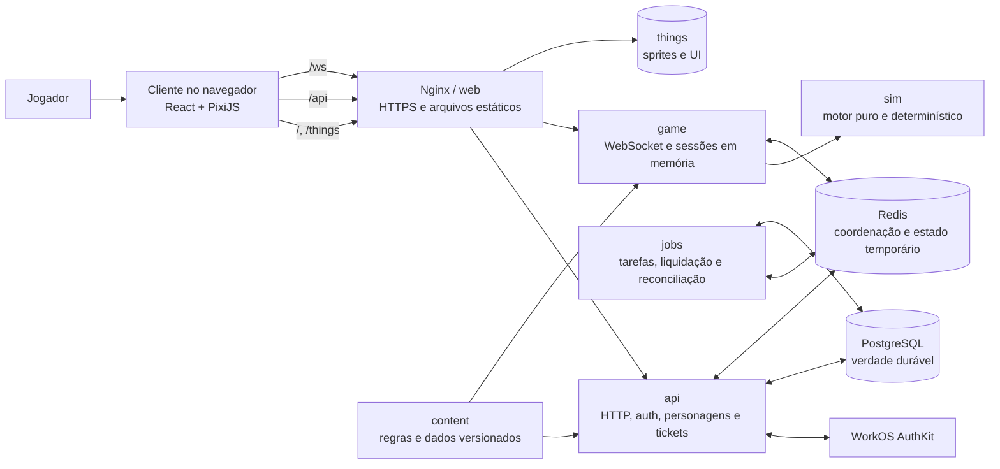
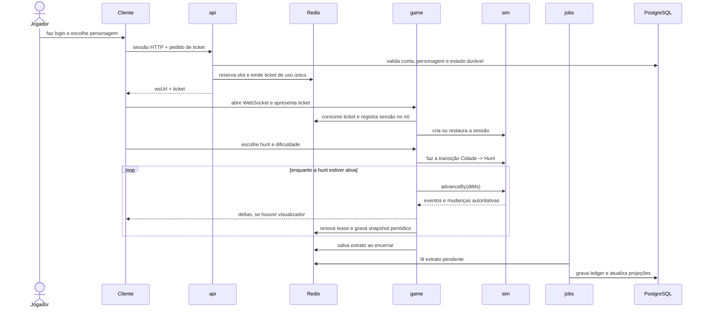
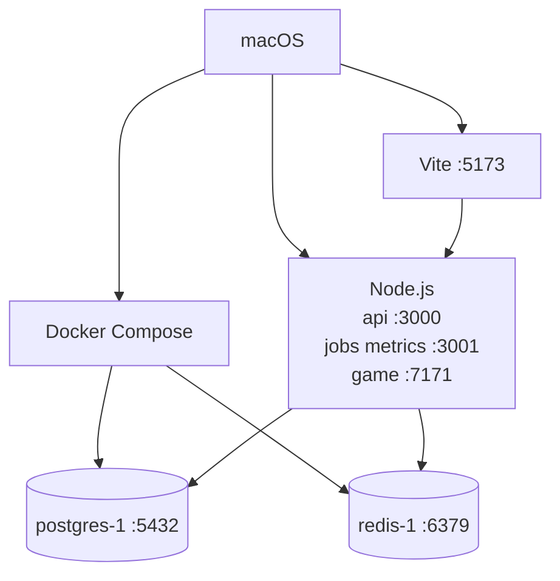
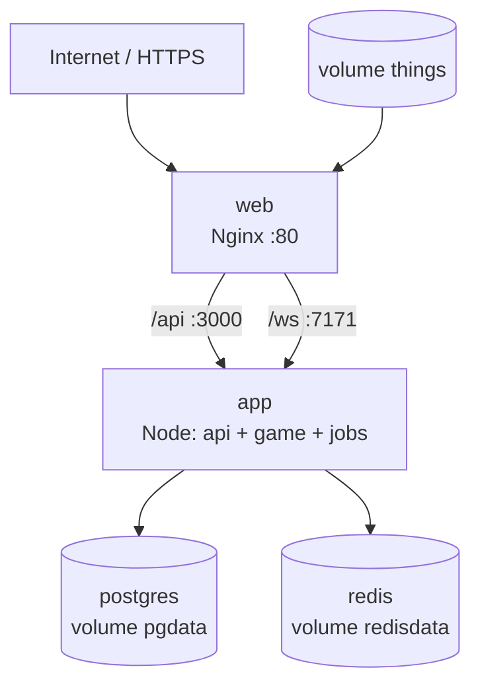

# Arquitetura do Draconya, explicada

**Natureza:** documento vivo

**Escopo:** visão integrada do sistema que existe hoje, da tela do jogador à persistência e ao
deploy

Este documento responde primeiro à pergunta operacional mais importante: **onde o jogo realmente
roda?** Depois abre cada camada e acompanha uma hunt completa, desde o login até o crédito final.

Para decisões e restrições mais detalhadas, consulte também:

- [`AGENTS.md`](../AGENTS.md), que contém os invariantes inegociáveis;
- [`architecture.md`](./architecture.md), que registra as restrições impostas pelo design;
- [`technical-architecture.md`](./technical-architecture.md), que é o plano técnico original;
- [`adr/`](./adr/), que preserva as decisões arquiteturais e suas alternativas;
- [`product/`](./product/), que descreve o comportamento implementado de cada sistema.

## 1. Resposta curta: onde ficam a aplicação e a hunt

Em desenvolvimento local, os contêineres `postgres-1` e `redis-1` **não são a aplicação do
jogo**. Eles são serviços de infraestrutura:

- o PostgreSQL guarda dados duráveis;
- o Redis coordena sessões e guarda dados temporários recuperáveis;
- os processos Node.js `api`, `game` e `jobs` formam a aplicação;
- a sessão de hunt e o personagem em atividade rodam, de fato, na memória do processo `game`;
- o navegador executa somente a apresentação e envia intenções ao servidor.

O comando local `docker compose up -d postgres redis` sobe somente banco e Redis. O comando
`pnpm dev` sobe os três papéis do servidor no processo Node.js local. O cliente Vite é iniciado
separadamente com `pnpm --filter @draconya/client dev`.

Em staging no Coolify, a topologia muda de embalagem, mas não de responsabilidade: o contêiner
`app` executa `api`, `game` e `jobs`; o contêiner `web` serve o cliente e faz proxy; PostgreSQL e
Redis continuam em contêineres separados.

## 2. Visão geral



Em desenvolvimento, o navegador fala diretamente com as portas locais e o bloco `web` não é
necessário. Em staging, o Nginx oferece uma origem única: `/api` vai para `api`, `/ws` vai para
`game`, e `/things` serve a arte.

## 3. O modelo arquitetural

O Draconya é um **monólito modular com três papéis de processo**. Não é uma coleção de
microserviços por domínio. Há um único repositório, uma linguagem ponta a ponta e uma mesma imagem
de servidor, mas o runtime separa trabalhos com perfis diferentes.

| Papel | Natureza | Responsabilidade | Escala pretendida |
|---|---|---|---|
| `api` | stateless | HTTP, autenticação, contas, personagens e emissão de tickets | várias réplicas |
| `game` | stateful | WebSocket, sessões, mundo e simulação | várias réplicas, cada sessão presa ao nó dono |
| `jobs` | singleton com lock | expirações, órfãos, liquidação e reconciliação | uma liderança lógica |

A variável `PROCESSES` escolhe os papéis do processo:

```text
PROCESSES=api,game,jobs  # modo solo, usado localmente e no staging atual
PROCESSES=game           # nó dedicado de simulação
PROCESSES=api,jobs       # exemplo de separação dos outros papéis
```

O modo solo reduz a operação necessária no estágio atual. A separação futura não exige outra
base de código nem outra imagem; muda a configuração e a quantidade de processos.

### Por que o `game` não pode ser serverless

Uma hunt precisa avançar sem requisição e sem navegador conectado. O `game` mantém estado em
memória, executa continuamente e aceita WebSockets de longa duração. Um runtime que dorme quando
não recebe HTTP quebraria o princípio idle-first: a hunt deixaria de ser simulação real e viraria
um cálculo estimado ao reconectar.

## 4. Os pacotes do monorepo

| Pacote | O que contém | O que não deve conter |
|---|---|---|
| `packages/protocol` | opcodes, mensagens, schemas e codec compartilhados | lógica de jogo ou acesso a dados |
| `packages/content` | monstros, hunts, mapas, itens, magias, bot e balanceamento | imagens, rede ou persistência |
| `packages/sim` | sessão, relógio lógico, eventos, movimento, combate, bot e loot | I/O, framework, rede, banco ou relógio global |
| `packages/server` | `api`, `game`, `jobs`, adaptadores de banco/Redis e hospedagem | código de interface do cliente |
| `packages/client` | React, PixiJS, store externo, conexão e interface | decisão autoritativa sobre o jogo |
| `packages/tools` | importadores, validadores, benchmarks e cliente de carga | regras exclusivas que deveriam estar em `sim` |

As fronteiras são verificadas pelo lint; não dependem apenas de disciplina. O mapa completo de
imports permitidos está em [`boundaries.md`](./boundaries.md).

## 5. Cliente: apresentação, entrada e previsão limitada

O cliente combina duas tecnologias porque elas resolvem problemas diferentes:

- **React e DOM** cuidam do HUD, menus, janelas, inventário, bot, analisador e bestiário;
- **PixiJS v8 e canvas** desenham o mundo em tiles, criaturas, efeitos e projéteis;
- uma **store fora do React** recebe o estado de rede e alimenta as duas apresentações;
- o Vite empacota e serve o cliente durante o desenvolvimento.

O navegador não é autoridade sobre posição resolvida, dano, loot, XP, gold ou resultado de uma
transação. Ele pode pedir `walk`, escolher uma hunt ou enviar uma nova configuração de bot. O
servidor valida a intenção, executa a regra e devolve o resultado.

Em conteúdo manual, o cliente pode prever somente o próprio passo para esconder latência. A
correção do servidor continua definitiva. Na hunt, bot, movimento, combate e recompensa rodam no
servidor mesmo quando a tela desaparece.

## 6. Protocolo: intenção entra, fato sai

`packages/protocol` é a fonte única das mensagens cliente-servidor e servidor-cliente. Os
opcodes não podem ser redefinidos no cliente ou no servidor.

Exemplos de entrada do cliente:

- anexar o visualizador à sessão;
- caminhar ou caminhar até um destino;
- entrar ou sair de uma hunt;
- escolher alvo;
- configurar o bot;
- conversar.

Exemplos de saída do servidor:

- estado completo da sessão;
- movimento e remoção de criatura;
- golpes, efeitos e projéteis;
- catálogo de hunts;
- inventário, analisador e bestiário;
- encerramento e extrato da sessão.

O transporte é WebSocket binário, com suporte a lote e compressão. O servidor envia, em regra,
um frame agregado por ciclo, evitando um `send` por evento. Ao reconectar, o cliente recebe o
estado atual e os agregados; não recebe horas de animações atrasadas.

## 7. Conteúdo e arte são coisas diferentes

O conteúdo do jogo vive em `packages/content/data` e é validado no boot. Ele define regras e
números: mapas, rotas, spawns, monstros, itens, magias, progressão, stamina e configuração padrão
do bot.

A versão de conteúdo é fixada quando a sessão nasce. Um deploy não pode trocar os atributos de
uma hunt que já está em andamento, porque isso tornaria o resultado impossível de reproduzir e
auditar.

A arte não fica em `content`. Sprites e recursos de UI vivem em `things/<version>` e são
referenciados por `appearanceId` e `outfitId`. Assim, trocar o pacote visual é remapear
identificadores, não reescrever monstros e itens. O servidor conhece os ids, mas não precisa
carregar bitmaps.

No Coolify, `things` é um volume montado como somente leitura no Nginx. Os nomes dos arquivos
incluem hash, permitindo cache imutável no navegador.

## 8. Simulação: o núcleo puro

`packages/sim` é deliberadamente isolado. Ele não consulta Postgres ou Redis, não abre socket,
não lê arquivos e não usa o relógio global. Isso permite testar uma hunt como uma função
determinística e executar milhares de sessões sintéticas sem subir infraestrutura.

### Relógio lógico e fila de eventos

Cada sessão tem um relógio lógico que começa em zero. O hospedeiro chama
`Session.advanceBy(dtMs)`, e uma fila ordenada por vencimento, prioridade e sequência despacha
cada ação no instante lógico correto.

Isso garante que avançar dez vezes 100 ms ou uma vez 1.000 ms produza os mesmos eventos nos
mesmos instantes. A taxa de chamada pode cair quando ninguém está assistindo sem mudar a
matemática da hunt.

### Taxas de avanço

| Tipo de sessão | Com visualizador | Sem visualizador |
|---|---:|---:|
| Cidade | orientada a evento | orientada a evento e recolhível após carência |
| Hunt | 10 Hz | 1 Hz |
| Quest, boss e guild war | 10 Hz | exigem presença; não são desenhados como conteúdo desanexado |

A taxa menor da hunt desanexada reduz chamadas do hospedeiro e elimina tráfego de apresentação.
A fila lógica preserva o resultado da simulação.

### RNG e snapshot

O gerador aleatório pertence à sessão e seu estado entra no snapshot. A mesma sessão restaurada
continua a sequência aleatória em vez de sortear outra história. Posição, fila de eventos, rota,
cooldowns, inventário quente, bot e agregados também precisam ser serializáveis.

## 9. O `game`: onde o personagem ativo realmente vive

O `SessionHost` mantém as sessões hospedadas pelo processo `game`. Para um personagem em hunt,
o estado quente inclui, entre outras coisas:

- posição e atributos atuais;
- monstros da instância;
- eventos futuros e cooldowns;
- estado do bot e alvo;
- índice da rota;
- RNG;
- inventário em uso na sessão;
- XP, gold, loot e métricas acumuladas desde o último crédito.

Esse estado fica em memória porque consultar banco a cada ação destruiria a latência e a
capacidade de escala. Há **um único dono** do estado quente: a sessão hospedada. Nenhum outro
processo pode alterar esse objeto em paralelo.

Um WebSocket não é a sessão. Ele é apenas um **visualizador** anexado a ela:

```text
sessão = personagem e simulação vivendo no servidor
visualizador = navegador observando e enviando intenções
```

Duas abas são dois visualizadores da mesma sessão. Fechar uma aba, perder Wi-Fi ou fechar todo o
navegador não encerra nem pausa uma hunt.

## 10. O ciclo completo de uma hunt



### 10.1 Autenticação HTTP

Em produção, o WorkOS AuthKit prova a identidade. O `api` associa essa identidade a uma conta
local e cria uma sessão opaca no Redis. O navegador recebe apenas um cookie `httpOnly`; a
credencial do WorkOS não vai para o socket do jogo.

Em desenvolvimento, `AUTH_DEV_MODE=true` habilita login local. O boot recusa esse modo em
produção.

### 10.2 Personagem e ticket

Depois de validar autenticação e propriedade do personagem, o `api` emite um ticket de sessão:

- vida curta, em torno de 30 segundos;
- uso único;
- consumido atomicamente;
- ligado ao nó `game` escolhido;
- associado à reserva de um dos slots ativos da conta.

O ticket separa a autenticação HTTP da admissão ao WebSocket: o cookie não é aceito diretamente
pelo socket, e um ticket repetido é recusado.

### 10.3 Entrada e execução

Entrar numa hunt é uma transição de estado exclusiva, não a criação informal de outro loop. O
servidor constrói a sessão de destino antes de encerrar a anterior. Se hunt ou dificuldade forem
inválidas, o personagem permanece onde estava.

A rota é fixa e versionada no conteúdo. O bot percorre essa rota; monstros usam movimento guloso
simples. Combate, loot, stamina, inventário e regras de saída produzem eventos na mesma fila
lógica.

### 10.4 Navegador fechado

Quando o último visualizador sai:

1. a sessão continua hospedada no mesmo `game`;
2. a taxa externa da hunt cai de 10 Hz para 1 Hz;
3. a mesma fila de eventos continua produzindo o mesmo resultado;
4. nenhum delta visual é serializado ou enviado;
5. snapshots, leases e progresso acumulado continuam sendo mantidos.

É isso — e não o PostgreSQL ou o Redis isoladamente — que faz a hunt continuar offline.

### 10.5 Reanexação

Ao voltar, o jogador é encaminhado ao nó que já possui a sessão. O socket se anexa como novo
visualizador e recebe `session-state`: posição atual, criaturas atuais, inventário, agregados e
uma lista curta de eventos notáveis. Eventos intermediários antigos não são reproduzidos.

### 10.6 Encerramento e crédito

Quando a hunt termina, o `game` produz um extrato. O `jobs` — ou o `api` antes de uma nova
entrada, quando há progresso pendente — liquida esse extrato no PostgreSQL.

Toda movimentação de valor passa pelo ledger. A chave única `(session_id, seq)` torna o retry
idempotente: repetir a mesma liquidação não duplica XP ou gold.

## 11. Onde cada tipo de dado vive

| Dado | Lugar principal | Por quê |
|---|---|---|
| posição, HP, monstros, cooldowns e fila da hunt ativa | memória do `game` | caminho quente, baixa latência e escritor único |
| conta, personagem, itens permanentes e ledger | PostgreSQL | verdade durável e transacional |
| sessão HTTP | Redis | expiração e invalidação rápidas |
| ticket de WebSocket | Redis | uso único e consumo atômico |
| nó dono de cada personagem e heartbeat dos nós | Redis | diretório distribuído com lease |
| limite de personagens ativos | Redis | reserva atômica e expiração |
| snapshot da sessão | Redis | restauração rápida depois de queda |
| extrato ainda não liquidado | Redis | ponte idempotente entre `game` e PostgreSQL |
| caixa de loot temporária | Redis | dado que deve expirar |
| lock de liderança de `jobs` | Redis | apenas um reconciliador lógico |
| regras e balanceamento | `packages/content/data` | versionamento junto do código |
| sprites e imagens de UI | volume `things` | arte separada do conteúdo e da imagem de servidor |

### Estado quente não é a linha do banco

O objeto em memória usado pela sessão é estado quente e tem um único escritor. A linha do
PostgreSQL é uma representação durável e pode ser atualizada por `jobs` ou `api`, sempre sob
trava de linha e idempotência do ledger. Misturar essas duas ideias levaria à conclusão errada de
que o PostgreSQL executa a hunt.

## 12. Redis não é “o jogo rodando”

O Redis contém o mapa operacional do sistema e material suficiente para recuperação, mas não
executa combate ou movimento. Ele responde perguntas como:

- qual nó possui este personagem?
- esse nó ainda está vivo?
- este ticket já foi consumido?
- há um snapshot ou extrato pendente?
- quantos personagens desta conta estão ativos?
- qual processo `jobs` possui a liderança?

Quem chama `advanceBy`, avalia o bot e resolve dano é o processo `game`, usando `sim`.

## 13. PostgreSQL não participa do tick

O PostgreSQL é a verdade durável de conta e economia, mas fica fora do caminho crítico das
ações. Não existe query por passo, ataque ou evento da fila.

As tabelas centrais implementadas incluem:

- `account`, com identidade externa e Coins;
- `character`, com progressão e configuração persistida;
- `item_instance`, com identidade, dono, quantidade, slot e proveniência;
- `ledger`, append-only e idempotente.

A coluna de gold do personagem é uma projeção conveniente. A trilha auditável é o ledger, e a
atualização ocorre na mesma transação que registra o movimento de valor.

## 14. Cidade, hunt e outros rulesets

Todo personagem está em exatamente um estado. Estados ativos correspondem a exatamente uma
sessão hospedada. A Cidade admite repouso sem sessão: depois da carência sem visualizador, sua
sessão pode ser recolhida porque não há simulação produtiva acontecendo.

A hunt é diferente: uma hunt desanexada nunca é recolhida só porque o navegador fechou.

O motor usa a abstração de ruleset para compartilhar ciclo de vida e mecânicas fundamentais:

- entrada;
- processamento de eventos;
- morte de criatura;
- encerramento;
- leitura e restauração de estado.

Hunt usa esse molde hoje. Treino, quest, boss e guild war devem reutilizá-lo sem criar outro
motor de movimento ou combate.

## 15. Falhas e recuperação

### O navegador fecha

A apresentação cai; a hunt continua no `game`. Ao voltar, o cliente recebe o estado atual.

### O Nginx ou o cliente web cai

Novas páginas e conexões deixam de entrar, mas sessões já hospedadas no `game` não dependem da
apresentação para calcular resultados.

### O `api` cai

Login, CRUD e novos tickets ficam indisponíveis. Uma hunt já hospedada pertence ao `game`, não ao
`api`.

### O `game` encerra de forma controlada

No `SIGTERM`, o servidor para de admitir trabalho novo, grava estado, encerra sessões creditando
o progresso e respeita a ordem de drenagem `api` → `jobs` → `game`. O processo tem 25 segundos
para drenar; o Compose concede 40 segundos antes de forçar a saída.

### O `game` cai abruptamente

O heartbeat e o lease expiram, mas o snapshot dura mais. Na reconexão, um novo nó pode tomar a
sessão órfã de forma atômica e restaurá-la. O intervalo em que nenhum processo rodou **não é
simulado retroativamente**; a sessão continua do último instante lógico persistido e o jogador é
avisado sobre a lacuna.

Uma versão de conteúdo incompatível não restaura a sessão silenciosamente. O sistema tenta
creditar o progresso recuperável antes de descartar o snapshot.

### Redis fica indisponível

O sistema perde coordenação, tickets, leases e persistência quente. As operações que dependem de
provar exclusividade falham fechadas; não se cria outro dono por suposição.

### PostgreSQL fica indisponível

Autenticação local, leitura durável e liquidação ficam indisponíveis. O desenho mantém banco fora
do tick, mas progresso só se torna definitivo quando o extrato é liquidado com sucesso.

## 16. Execução local



Sequência típica:

```bash
pnpm install
cp .env.example .env
docker compose up -d postgres redis
pnpm db:push
pnpm dev
pnpm --filter @draconya/client dev
```

O grupo Compose cujo nome deriva de uma worktree, como
`huntera-game-analysis-824bde`, apenas agrupa os serviços declarados no `docker-compose.yml`
daquela pasta. O nome não indica uma aplicação diferente nem um servidor especial de Huntera.
Na configuração local atual, dentro dele existem somente PostgreSQL e Redis.

## 17. Execução no Coolify



Somente `web` é publicado. PostgreSQL e Redis ficam na rede interna. O TLS termina no proxy do
Coolify, e o Nginx preserva o upgrade do WebSocket em `/ws`.

Antes de iniciar o runtime, o contêiner `app` aplica as migrações. O boot valida configuração,
conectividade, conteúdo e compatibilidade do pacote de arte. Falhar cedo é preferível a aceitar
jogadores com um sistema parcialmente configurado.

O pipeline do GitHub executa documentação, código e boot da imagem. Depois de merge na `main`, o
job de staging sincroniza configuração, dispara o Coolify e verifica estado, SHA publicado,
healthcheck e rotas públicas.

## 18. Segurança e consistência

As principais barreiras não são cosméticas:

1. o cliente envia intenção, nunca resultado;
2. schemas validam mensagens na fronteira;
3. tickets são curtos, únicos e ligados ao nó;
4. apenas a sessão dona escreve estado quente;
5. a transição de estado impede duas sessões para o mesmo personagem;
6. o limite por conta é atômico no Redis;
7. o ledger torna crédito repetido inofensivo;
8. a versão de conteúdo permanece fixa;
9. falha de coordenação recusa a operação em vez de inventar um dono;
10. autenticação de desenvolvimento é proibida em produção.

A automação do bot é parte legítima do produto. Defesa contra abuso mira multiconta e RMT, não o
comportamento automático que o próprio servidor oferece.

## 19. Observabilidade e validação

Os três papéis expõem métricas Prometheus em suas portas. Logs estruturados identificam os
papéis hospedados. Métricas evitam rótulos com `characterId` ou `sessionId`, que criariam
cardinalidade ilimitada.

O comando de validação integrada é:

```bash
pnpm check
```

Ele executa lint, typecheck, testes, validação de documentação, política de código-fonte e
inventário de assets. Testes de integração usam PostgreSQL e Redis descartáveis explícitos, para
não limpar bancos de desenvolvimento por engano.

Benchmarks de monstro, hunt, cidade e cliente sintético medem o desenho, mas não substituem a
observação de um deploy real.

## 20. O que existe hoje e o que ainda é destino

Já há implementação para a espinha dorsal: autenticação, personagens, tickets, WebSocket,
sessões, Cidade, hunt, movimento, combate, bot, stamina, progressão, loot, inventário,
analisador, bestiário, snapshots, extratos e ledger. Alguns desses sistemas ainda são parciais;
o status preciso está em [`product/`](./product/).

Ainda não são sistemas completos de produção: party, treino, quests, bosses, guildas, guild war,
prey, market, pagamentos e monetização. Eles aparecem na arquitetura porque suas necessidades
influenciam as fronteiras atuais, não porque já estejam funcionando.

## 21. Os onze invariantes, em linguagem direta

1. `sim` não conhece infraestrutura.
2. ações vencem numa fila lógica; não se escreve fórmula dependente de tick.
3. assistir ou não assistir não muda o resultado.
4. o cliente pede; o servidor decide.
5. opcodes têm uma fonte única em `protocol`.
6. conteúdo referencia arte por ids.
7. a sessão não troca de versão de conteúdo no meio.
8. o personagem ocupa exatamente um estado; estado ativo tem uma sessão dona.
9. apenas a sessão dona altera o estado quente.
10. valor passa pelo ledger idempotente.
11. o bot oficial é uma mecânica, não uma infração.

Qualquer mudança que viole um desses pontos exige um ADR e atualização do norte arquitetural.

## 22. Diagnóstico rápido: “o jogo está rodando?”

Ver `postgres-1` e `redis-1` verdes prova apenas que a infraestrutura local está saudável. Para
uma hunt estar sendo processada, também é necessário que exista um processo `game` vivo e que a
sessão esteja hospedada nele.

Use estas verificações em conjunto:

```bash
docker compose ps
curl http://localhost:3000/healthz
curl http://localhost:3001/metrics
curl http://localhost:7171/healthz
```

Interpretação:

| Evidência | O que prova |
|---|---|
| PostgreSQL saudável | o armazenamento durável está disponível |
| Redis saudável | a coordenação e os dados temporários estão disponíveis |
| `api` saudável | login, personagens e tickets podem responder |
| `game` saudável | existe um runtime capaz de hospedar e avançar sessões |
| sessão no diretório + lease vivo | um personagem está atribuído a um nó |
| métricas/eventos da sessão mudando | a simulação está efetivamente avançando |

Nenhum item isolado prova o sistema inteiro. Em especial, **um contêiner de banco saudável não
prova que uma hunt está rodando**.
